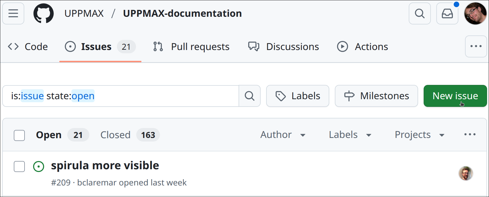

---
tags:
  - contribute
  - contributing
  - help
  - helping
  - how to help
  - how to contribute
  - how to modify content
  - how to add content
  - how to suggest content
---

# Contributing

Thanks for considering to contribute and reading this!

Here we discuss how to contribute.

What do you want to do                                    |How to do it
----------------------------------------------------------|------------------------------------
Share your knowledge in general terms                     |[Create an issue](#create-an-issue)
Share your knowledge by adding content to an existing page|[Modifying content](#modify-content)
Share your knowledge by adding content to a new page      |[Add new page](#modify-content)
Share your knowledge by modifying content                 |[Modifying content](#modify-content)
Report mistakes                                           |[Create an issue](#create-an-issue)
Suggest improvements in general terms                     |[Create an issue](#create-an-issue)
Suggest improvements by modifying content                 |[Modifying content](#modify-content)
Give anonymous feedback                                   |[Go to this form](https://docs.google.com/forms/d/e/1FAIpQLScu1zrUnXw2qq2dA0oJB72-nILVq5mwScq75N_u_7KH2NJznw/viewform)

See [the contribution questions](#contribution-questions) if you still have
a question about contributing.

## Create an issue

Issues are 'things that need to be done', for example:

- ideas, e.g [Suggest: Improve WinSCP documentation](https://github.com/UPPMAX/UPPMAX-documentation/issues/129)
- feedback, e.g [Log in: one page too many](https://github.com/UPPMAX/UPPMAX-documentation/issues/174)
- messages, e.g [Chromium renders mermaid graphs incorrectly](https://github.com/UPPMAX/UPPMAX-documentation/issues/176)

Anyone with a GitHub account can create an [issue](https://github.com/UPPMAX/UPPMAX-documentation/issues).

???- question "How to create an issue?"

    - Log in to your GitHub account
    - Go to [the issues](https://github.com/UPPMAX/UPPMAX-documentation/issues)
    - Click on the green button 'Create issue'
    
    

    > Click on 'Create issue'

    - Write a title and description
    - At the bottom of the page, click the green button 'Create'

    

    > Click on 'Create'

    Thanks!

These issues will be discussed in a meeting and/or in the issue itself.

Ideas that improve the experience of UPPMAX users trying to use our resources
are likely to be accepted.

## Modify content

The goal of the UPPMAX documentation is to document how to use our resources.
We welcome any contribution that helps us achieve this goal.

Ideally, such a contribution also ..

- follows all standards set by the continuous integration tools
  (e.g. use 4 spaces for indentation).

Anyone with a GitHub account can suggest changes by clicking the 'Edit'
button, whihc is present on each document page.

???- question "How to create an issue?"

    - On any documentation page, click 'Edit'

    

    > Click 'Edit'

    - In the next page, click 'Edit this file'

    

    > Click 'Edit this file'

    - Modify the Markdown file

    - Click on the green 'Commit changes' button

    

    What follows depends on who you are:

    - If you are not UPPMAX staff, you will be asked to create a fork
      and create a pull request. Whatever this is, yes, do that :+1: .
      After that, the UPPMAX staff will take a look at your suggestion
    - If you are UPPMAX staff, your changes are directly added.
      It takes several minutes until this is visible on the website.

## Add new page

The goal of the UPPMAX documentation is to document how to use our resources.
We welcome any contribution that helps us achieve this goal.

Ideally, such a contribution also ..

- follows all standards set by the continuous integration tools
  (e.g. use 4 spaces for indentation).
- puts the files in reasonable folders
  (see [Where to put files?](#where-to-put-files) below)

If it does not, we'll fix it for you :+1:

???- question "How to add a new page?"

    - Go to the GitHub repository behind the UPPMAX documentation webpage,
      by clicking on the word 'GitHub'

    

    > Click on the word 'GitHub'

    - In GitHub repository, navigate to the folder you want to add a file,
      by clicking on the folders' names

    - On any documentation page, click 'Add new file'

    

    - Specify a name for the file and write is content in Markdown
    - Click on the green 'Commit changes' button

    

    What follows depends on who you are:

    - If you are not UPPMAX staff, you will be asked to create a fork
      and create a pull request. Whatever this is, yes, do that :+1: .
      After that, the UPPMAX staff will take a look at your suggestion
    - If you are UPPMAX staff, your changes are directly added.
      It takes several minutes until this is visible on the website.

## Contribution questions

### Where to put a new page: here or at <https://www.uu.se/en/centre/uppmax>?

[It has been decided upon](https://github.com/UPPMAX/UPPMAX-documentation/issues/128)
that, as a general rule,
information should be on SiteVision until a user applies to a project.
This means that information about applying for a project
and using our clusters should be on this repository.

[It has been decided upon too](https://github.com/UPPMAX/UPPMAX-documentation/issues/128)
to try hard for minimal duplication.

[Specific points that have been decided upon](https://github.com/UPPMAX/UPPMAX-documentation/issues/128):

What                                  |Where
--------------------------------------|-------------------------
Applying for an account               |Here
Applying for NAISS projects           |Here
Applying for a local project          |Here
PUBA                                  |Here
Services offered through UIT [1]      |Here
Log in to each cluster                |Here
General description of hardware       |SiteVision
Detailed Hardware (e.g. how to access)|Here
System usage                          |Link from both
List of UPPMAX courses                |SiteVision
Course pages                          |Here
Course registrations                  |Investigate first
Support                               |Keep things as they are

- [1] If such a page is needed

## Where to put files?

All files are put in `docs` or `docs/[some_folder]`,
but not not deeper than that.

Description                                             | Where          | Typical name
--------------------------------------------------------|----------------|------------------------------------------
Information about clusters                              |`cluster_guides`|`bianca.md`, `rackham.md`, `snowy.md`
Information about Slurm                                 |`cluster_guides`|`slurm.md`
Information about general cluster processes             |`cluster_guides`|`[general_process_name].md`
Cluster-specific information about Slurm                |`cluster_guides`|`slurm_on_bianca.md`, `slurm_[something].md`
Cluster-specific information for software, except Slurm |`software`      |`[x]_on_bianca.md`, `rackham_do_something_with_[x].md`
Software in general, except Slurm                       |`software`      |`[name of program].md`

Examples on file transfer:

- `software/bianca_file_transfer_using_rsync.md`
- `software/rsync.md`
- `cluster_guides/file_transfer.md`

Examples on job scheduler:

- `cluster_guides/slurm_on_bianca.md`
- `software/squeue.md`
- `software/sbatch.md`
- `cluster_guides/slurm.md`

Examples on general software use:

- `software/gcc.md` (a collection of programs is software)
- `software/gcc_compile_c.md` (same for all clusters)

## Which `git` branch should I use?

Submitting to the main branch is fine! Thanks!
