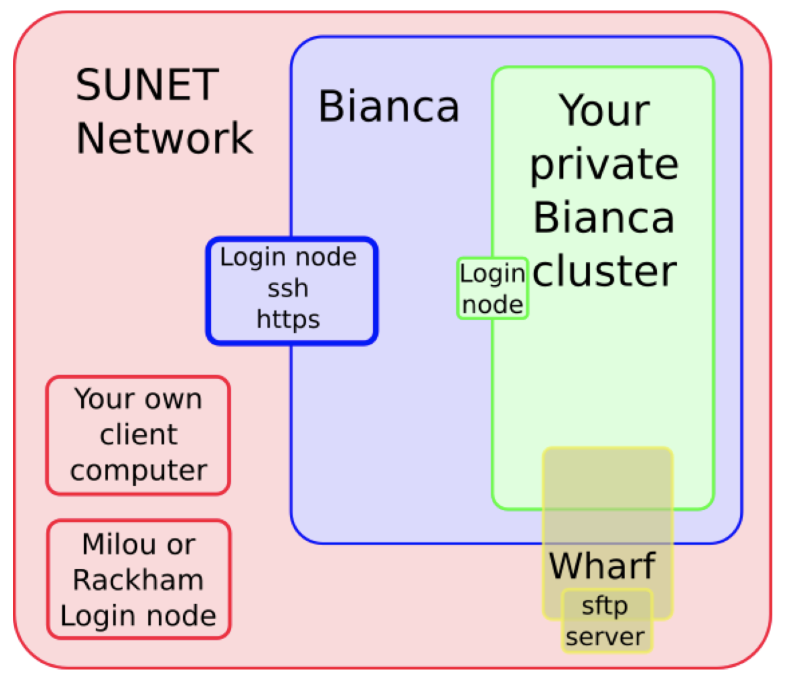

# Bianca's design

[Bianca](bianca.md) is an high-performance computing (HPC) cluster for sensitive data.

???- question "What is an HPC cluster for sensitive data?"

    What an HPC cluster for sensitive data is, is described [here](uppmax_cluster.md).

Or: Bianca is a group of computers that can effectively run many calculations,
as requested by multiple people, at the same time.
As the data is sensitive, it is protected to remain only on Bianca.

Bianca is designed to:

- make accidental data leaks difficult
- make correct data management as easy as possible
- emulate the HPC cluster environment that SNIC users were familiar with
- provide a maximum amount of resources
- satisfy regulations

???- info "The Bianca architecture"

    

    > Bianca's architecture.
    > Red shows the university networks.
    > Blue shows the whole cluster, with hundreds of nodes.
    > Green shows virtual project clusters.
    > Yellow shows where file transfer occurs.

Bianca's architecture reflects that
she is an HPC cluster for sensitive data:
the whole Bianca cluster has hundreds
of virtual project clusters,
each of which is isolated from each other and the Internet.
File transfer is only possible through the the so-called 'wharf',
which is a special file area that is visible from the Internet.

!!! info "Bianca has no internet"

    - You *can* log in, but with extra steps
    - You *can* transfer files, but with extra steps
    - We recommend using the remote desktop login,
      see [here](../getting_started/login_bianca.md)

As Bianca is an HPC cluster that should be as easy to
use as possible, there are two ways to interact with Bianca:
one more visual, the other a command-line environment.
Both environments are shown below.

As Bianca has sensitive data, there are constraints on how to
access Bianca.

One such constraint in accessing Bianca,
is that one has to be within the university
networks, as described at [get within the university networks](../getting_started/get_inside_sunet.md).

Another such constraint, is that data can be
transferred to or from a virtual project cluster through the so-called 'wharf',
which is a special file area that is visible from the Internet.
File transfer is described in more detail [here](../cluster_guides/transfer_bianca.md).

Bianca runs the Linux operating system and all users need some
basic Linux knowledge to use Bianca.

???- tip "Using Linux"

    Using Linux (and especially the so-called command-line/terminal) is essential
    to use Bianca. Learning the essential Linux commands
    is described [here](../getting_started/linux.md).

## Overview of all steps possible/needed to access Bianca

```mermaid
flowchart TD

    subgraph sub_outside[IP outside SUNET]
      outside(Physically outside SUNET)
    end

    subgraph sub_inside[IP inside SUNET]
      physically_inside(Physically inside SUNET)
      inside_using_vpn(Inside SUNET using VPN)
      inside_using_rackham(Inside SUNET using Rackham)

      subgraph sub_bianca_shared_env[Bianca shared network]
        bianca_shared_console[Bianca console environment login]
        bianca_shared_remote_desktop[Bianca remote desktop login]
        subgraph sub_bianca_private_env[The project's private virtual project cluster]
          bianca_private_console[Bianca console environment]
          bianca_private_remote_desktop[Bianca remote desktop]
          bianca_private_terminal[Terminal]
        end
      end
    end

    %% Outside SUNET
    outside-->|Move physically|physically_inside
    outside-->|Use a VPN|inside_using_vpn
    outside-->|Login to Rackham|inside_using_rackham

    %% Inside SUNET
    physically_inside-->|SSH|bianca_shared_console
    physically_inside-->|UPPMAX website|bianca_shared_remote_desktop
    physically_inside-.->inside_using_rackham
    physically_inside-.->inside_using_vpn
    inside_using_vpn-->|SSH|bianca_shared_console
    inside_using_vpn-->|UPPMAX website|bianca_shared_remote_desktop
    inside_using_rackham-->|SSH|bianca_shared_console

    %% Shared Bianca
    bianca_shared_console --> |UPPMAX password|bianca_private_console
    bianca_shared_remote_desktop-->|UPPMAX password|bianca_private_remote_desktop

    %% Private Bianca
    bianca_private_console---|is a|bianca_private_terminal
    bianca_private_remote_desktop-->|must also use|bianca_private_terminal
```

This is an overview of all steps possible/needed to access Bianca.
