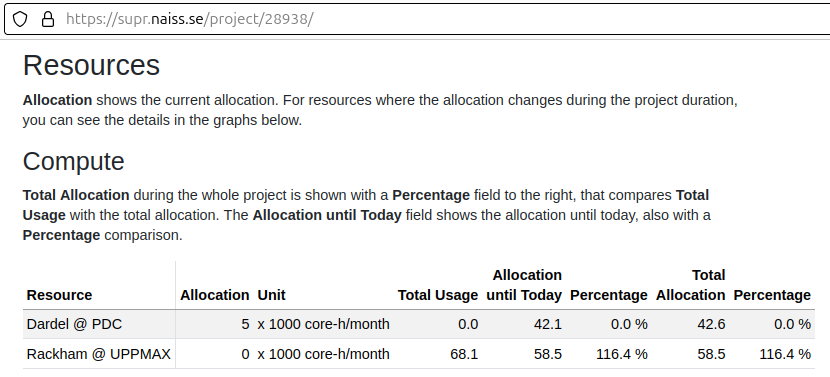

---
tags:
  - UPPMAX
  - cluster
  - clusters
  - speed
  - fast
  - slow
---

# Cluster speeds

Sometimes you feel a cluster is slow.

Below are some benchmark results, so you can compare with what you are
experiencing.

Please [contact support](../support.md) when you find out that your favorite
cluster is slower than expected.

???- question "What could cause such a slowdown?"


    > When things are slow it is usually due to latency
    > when many processes are accessing the same files
    > and physical hard drives

    Examples:

    - 2024-12-06: Castor is still holding some file systems for Bianca
      or a user that is running a lot of very short lived Perl jobs on Bianca,
      that are running too hard on Castor.

## Starting an interactive session with two cores for one hour

In general:

- It takes seconds if a free compute node is available
- It takes minutes to start a new node

Date and time  |Cluster|Command                                     |You waited for `x` seconds|Complete time (secs)
---------------|-------|--------------------------------------------|--------------------------|--------------------
2024-12-19 8:00|Bianca |`interactive -A sens2023036 -n 2 -t 1:00:00`|518 (8:38)                |548 (9:08)

You can expect longer times if:

- [The Bianca system usage](https://status.uppmax.uu.se/usage/) is at maximum
  capacity (which it nearly never is)
- Your [project](../getting_started/project.md) has used up all of its
  computational resources

???- question "How can I check that my project has used all of its resources?"

    Go to [https://supr.naiss.se](https://supr.naiss.se), click
    on your project and scroll down to 'Resources'.

    There you can see how much of the computational resources you've used.

    For example, below is an example project showing its resource usage:

    

    We can see that it uses zero percent of the computation resources
    of the Dardel HPC cluster, yet 116.4% of Rackham's. Starting an
    interactive job on Rackham may hence take longer.

## Loading the `R_packages/4.3.1` module

For [a benchmark to solve a ticket](https://github.com/UPPMAX/ticket_304069/blob/master/module_load.md#answers),
the following command was run in multiple settings:

```bash
time module load R_packages/4.3.1
```

From the three resulting times, the 'Real' time is used.

Here are some expected timings:

Project    |Setting                     |Real loading time
-----------|----------------------------|-----------------
Rackham    |SSH                         |0m0.758s
Bianca     |SSH                         |0m8.984s

Here are some unexpected timings:

Project    |Setting                     |Real loading time
-----------|----------------------------|-----------------
sens2023598|SSH                         |6m1.265s
sens2023598|Website                     |6m20.234s
sens2017625|SSH                         |6m4.584s
sens2017625|Website, interactive session|7m41.433s
sens2017625|SSH, interactive session    |7m13.111s


## Loading the `RStudio/2023.12.1-402` module

Project    |Setting                     |Real loading time
-----------|----------------------------|-----------------
Bianca     |Website                     |2m3.184s

