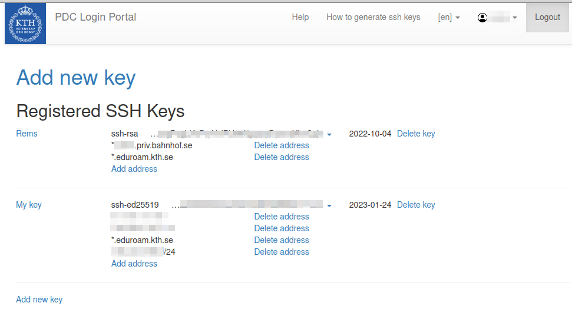
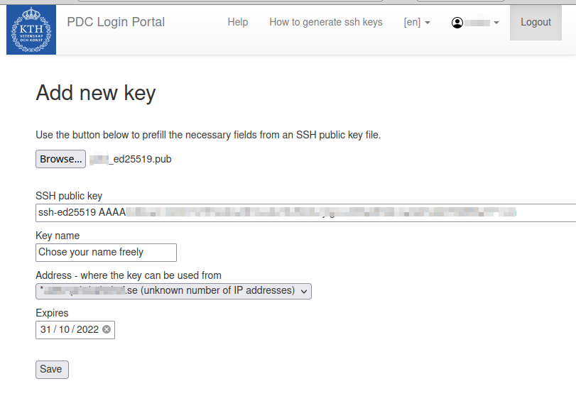

# Dardel SSH Key Guide

This guide will show you how to create SSH keys and how to add them to the PDC Login Portal, making it possible for you to login to Dardel. PDC has [a more comprehensive guide on how to do this on various operating systems](https://www.pdc.kth.se/support/documents/login/ssh_keys.html) if you want a more in-depth guide.

## Creating SSH keys

To create a SSH key, run the following command:

```bash
ssh-keygen -t ed25519
```

This will start the creating of a SSH key using the `ed25519` algorithm. The program will ask you where to save the file,

```bash
user@rackham ~ $ ssh-keygen -t ed25519
Generating public/private ed25519 key pair.
Enter file in which to save the key (/home/user/.ssh/id_ed25519): 
```

If you just press enter it will save the new key using the suggested name, `/home/user/.ssh/id_ed25519`

If it asks you if you want to overwrite, you probably want to press `n` since you already have one created and might want to use that one instead. If you overwrite it you will lose access to wherever the old key file is used, so just run the `ssh-keygen` command above again and type in a new name for the file.

```
/home/user/.ssh/id_ed25519 already exists.
Overwrite (y/n)? 
```

The next step is to add a password to your key file. This makes sure that even if someone manages to copy your key they will not be able to use it without the password you set here. Type in a password you will remember, press enter, type it in again and press enter.

```
Enter passphrase (empty for no passphrase): 
Enter same passphrase again: 
```

The key will now be created and you can add it to the PDC Login Portal.

```
Your identification has been saved in /home/user/.ssh/id_ed25519
Your public key has been saved in /home/user/.ssh/id_ed25519.pub
The key fingerprint is:
SHA256:g+rvY4HoDNlim+Bj43L3pxr56hrlwC4hzPa/yE/2YqE user@rackham
The keys randomart image is:
+--[ED25519 256]--+
|.o               |
|o   .            |
| . = .           |
|    B ..         |
| + * B..S        |
|= + o =          |
|*+.oo=..         |
|+=oE+ B          |
| o +*X o         |
+----[SHA256]-----+
```


## Adding SSH keys to PDC Login Portal

[(Link to PDC:s own instructions)](https://www.pdc.kth.se/support/documents/login/ssh_login.html#ssh-login)

1. Go to the [PDC Login Portal](https://loginportal.pdc.kth.se/)
2. Follow the instructions on that page to login through SUPR.

You should now be logged into the login portal:



Click the `Add new key` link:



Here you can either upload the public part of the key file you created before, or you can enter the information manually. To see the public key to enter it manually, run this command:

```bash
cat ~/.ssh/id_ed25519.pub
```

and copy the text, e.g. `ssh-ed25519 AAmAC3Nz2C1lZDI4N4E5AAAAXEjxKoZ72x69eRd+A2h2GDxnAlD7deITZx7pK8TgEppE user@rackham`
Paste it into the field `SSH public key`, make up a name for the key so you know which computer it is on and fill it into the field `Key name`.

In the field `Address` you have to specify which IP address(es) are allowed to use this key. The field is prefilled with the IP of the computer you are on at the moment.


### (optional) Adding UPPMAX to addresses

If you want to connect to Dardel from UPPMAX you have 


