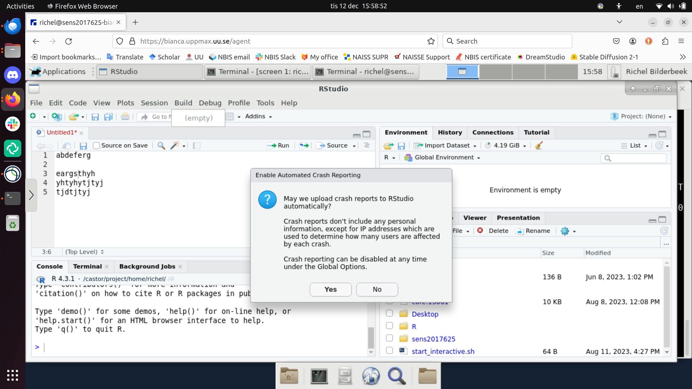

# RStudio on Bianca


## Introduction

RStudio is an IDE specialized for the R programming language.

???- tip "What is an IDE?"

    See [the page on IDEs](ides.md).

In this session, we show how to use RStudio on Bianca,
using Bianca's remote desktop environment.

???- tip "Forgot how to login to a remote desktop environment?"

    See [the 'Logging in to Bianca' page](../getting_started/login_bianca.md).

    Spoiler: go to [https://bianca.uppmax.uu.se/](https://bianca.uppmax.uu.se/)

As RStudio is a resource-heavy program,
it must be run on an interactive node.

???- tip "Forgot how to start an interactive node?"

    See [the 'Starting an interactive node' page](start_interactive_node_on_bianca.md).

## Procedure to start RStudio

Below is a step-by-step procedure to start RStudio.
This procedure is also demonstrated in [this YouTube video](https://youtu.be/rRUb4pqaVak).

### 1. Get within SUNET

???- question "Forgot how to get within SUNET?"

    See the 'get inside the university networks' page [here](../getting_started/get_inside_sunet.md)

### 2. Start the Bianca remote desktop environment

???- tip "Forgot how to start Bianca's remote desktop environment?"

    See [the 'Logging in to Bianca' page](../getting_started/login_bianca.md).

### 3. Start an interactive session

Within the Bianca remote desktop environment, start a terminal.
Within that terminal, start an interactive session with 2 cores.

!!!- info "Why two cores?"

    RStudio is a resource-heavy program.
    Due to this, we recommend using at least two cores 
    for a more pleasant user experience.

???- tip "Forgot how to start an interactive node?"

    See [the 'Starting an interactive node' page](start_interactive_node_on_bianca.md).

    Spoiler: use:

    ```
    interactive -A sens2023598 -n 2 -t 8:00:00
    ```

!!!- warning "Do not start RStudio from the menus"

    You can start a version of RStudio from the menus.
    However, this will not have access to loaded modules.

    Instead, load RStudio from the module system instead.


### 4. Load the modules needed

In the terminal of the interactive session, do:

```
module load RStudio/2023.06.2-561
```

???- question "Do I need to load `R` or `R_packages`?"

    No.

    Although RStudio needs R and some R packages,
    these are loaded automatically via the module system.

    Loading the module `RStudio` 
    will load the latest `R` and `R_packages` modules for you.

### 5. Start RStudio

With the modules loaded, start RStudio from the terminal (on the
interactive node):

```
rstudio
```

RStudio can be slow to startup, as R has thousands (!) of packages.
Additionally, at startup and if enabled, your saved RStudio workspace
(with potentially a lot of data!) is read.

???- info "How does RStudio look on Bianca?"

    RStudio when starting up:

    

    RStudio when started up:

    

    RStudio in action:

    

    The RStudio debugger, at the error message level:

    

    The RStudio debugger, at the function-that-caused-the-error level:

    

    The RStudio debugger, at the program level:

    
