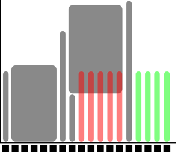

# The job scheduler and the queue

- How does the queue work?

- Let's look graphically at jobs presently running.

- *x-axis: cores, one thread per core*
- *y-axis: time*
  

- We see some holes where we may fit jobs already!
- Let's see which type of jobs that can fit!

 

- 4 one-core jobs can run immediately (or a 4-core wide job).*

    - *The jobs are too long to fit at core number 9-13.*

 

- A 5-core job has to wait.*

    - *Too long to fit in cores 9-13 and too wide to fit in the last cores.*

- Easiest to schedule *single-threaded*, short jobs

!!! tip

    - You don't see the queue graphically, however.
    - But, overall:
        - short and narrow jobs will start fast
        - test and development jobs can get use of specific development nodes if they are shorter than 1 hour and uses up to two nodes.
        - waste of resources unless you have a parallel program or need all the memory, e.g. 128 GB per node

