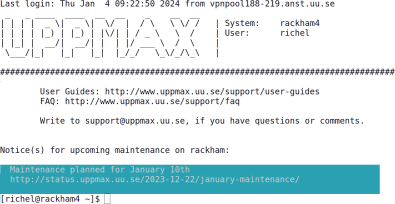

# Starting an interactive node on Snowy



Snowy has three types of nodes:

???- tip "What are nodes?"

    What nodes are, is described in general terms [here](uppmax_cluster.md).

- **login nodes**: nodes where a user enters and interacts with the system
- **calculation nodes**: nodes that do the calculations

???- tip "Requesting a calculation to run"

    Requesting a calculation is described [here](slurm.md).
    This is done by using the SLURM scheduler.

- **interactive nodes**: a type of calculation node, 
  where a user can do calculations directly

???- tip "How can I find out on which node I am?"

    In a terminal, type `hostname`:

    - the login node has name `rackham[number]`, where `[number]` is the number of the login node
    - an interactive node has name `r[number]`, where `[number]` is the compute node number

As the login node is shared with all users, 
there is a simple rule to use it fairly:

> Only do short and light things on the login node

Examples of short and light things are:

- Editing files
- Copying, deleting, moving files
- Scheduling jobs
- Starting an interactive session

Examples of heavy things are:

- Running code with big calculations
- Develop code with big calculations line-by-line 

???- tip "Develop code with big calculations line-by-line"

    This usage is typically done an interactive node

### Use-case for using an interactive node

Some users develop computer code on Snowy
in a line-by-line fashion. 
These users typically want to run a (calculation-heavy) 
script frequently, to test
if the code works.

However, scheduling each new line is too slow, as it
can take minutes before the new code is run.
Instead, there is a way to directly work 
with such code: use an interactive node.

An interactive node is a type of calculation node,
where one can run heavy calculations directly.


```mermaid
flowchart TD
    UPPMAX(What to run on which node?)
    operation_type[What type of operation/calculation?]
    interaction_type[What type of interaction?]
    login_node(Work on login node)
    interactive_node(Work on interactive node)
    calculation_node(Schedule for calculation node)

    UPPMAX-->operation_type
    operation_type-->|light,short|login_node
    operation_type-->|heavy,long|interaction_type
    interaction_type-->|Direct|interactive_node
    interaction_type-->|Indirect|calculation_node
```

To use an interactive node, in a terminal, type:

```bash
interactive -A [project name] -M snowy
```

For example:

```bash
interactive -A uppmax2023-2-25 -M snowy
```

This starts an interactive session using project `uppmax2023-2-25`
that has a default duration of 1 hours.

???- tip "Forgot your Snowy project?"

    One can go to the SUPR NAISS pages to see one's projects,

    

    > Example of the Snowy project called 'UPPMAX 2023/2-25'

    On the SUPR NAISS pages, projects are called 'UPPMAX [year]/[month]-[day]',
    for example, 'UPPMAX 2023/2-25'.
    The UPPMAX project name, as to be used on Snowy, 
    has a slightly different name:
    the account name to use on Snowy is `uppmax[year]-[month]-[day]`,
    for example, `uppmax2023-2-25`

To increase the duration of the interactive session, 
add the use of `-t`:

```bash
interactive -A [project name] -M snowy -t [session_duration]
```

For example:

```bash
interactive -A uppmax2023-2-25 -M snowy -t 8:00:00
```

This starts an interactive session using project `uppmax2023-2-25`
that has a maximum duration of 8 hours.

!!! note "Has Snowy frozen?"

    It can take tens of seconds before an interactive node is allocated.

    Snowy has not frozen, just be a bit more patient.

