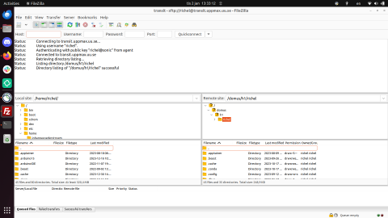
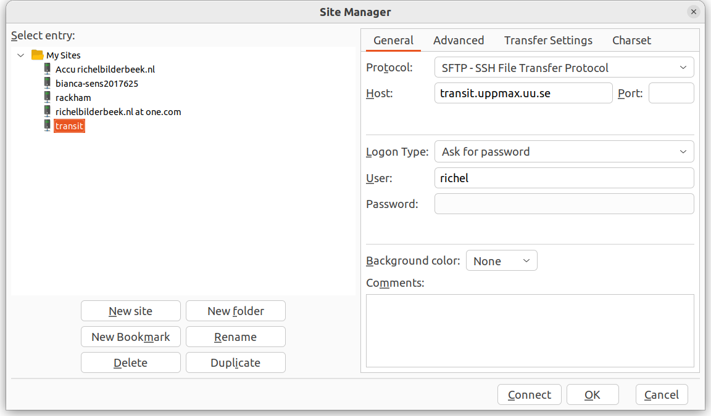

# File transfer to/from Transit using a graphical tool

Data transfer to/from Transit using a graphical tool
is one of the ways to transfer files to/from Transit

???- question "What are the other ways?"

    Other ways to transfer data to/from Transit are described [here](transfer_transit.md)

Here, we show how to transfer files using a graphical tool called FileZilla.

> FileZilla connected to Transit

## Using FileZilla

> The FileZilla logo

???- question "Would you like a video?"

    If you like to see how to do file tranfer from/to Transit
    using FileZilla, watch the video 
    [here](https://youtu.be/7wHRCMdnNZE)

FileZilla is a secure file transfer tool that works under Linux, Mac and Windows.

To transfer files to/from Transit using FileZilla, do:

- Start FileZilla
- From the menu, select 'File | Site manager'

???- tip "Where is that?"

    It is here:

    
    
    > The FileZilla 'File' menu contains the item 'Site manager'

- Click 'New site'

???- tip "Where is that?"

    It is here:

    

- Create a name for the site, e.g. `transit`.
- For that site, use all standards, except:
    - Set protocol to 'SFTP - SSH File Transfer Protocol'
    - Set host to `transit.uppmax.uu.se`
    - Set user to `[username]`, e.g. `richel`

???- tip "How does that look like?"

    It looks similar to this:

    

- Click 'Connect'
- You will be asked for your password, hence
  type `[your password]`, e.g. `VerySecret`.
  You can save the password.

???- tip "How does that look like?"

    It looks similar to this:

    

Now you can transfer files between your local computer and Transit.

???- tip "How does that look like?"

    It looks like this:

    

## Where do my files end up?

They end up in your personal home folder.

Its location is at `/home/[user_name]`,
for example, at `/home/sven`.

???- tip "How does that look like?"

    It looks like this:

    

### File transfer overview

```mermaid
flowchart TD

    %% Give a white background to all nodes, instead of a transparent one
    classDef node fill:#fff,color:#000,stroke:#000

    %% Graph nodes for files and calculations
    classDef file_node fill:#fcf,color:#000,stroke:#f0f
    classDef calculation_node fill:#ccf,color:#000,stroke:#00f

    user(User)
      user_local_files(Files on user computer):::file_node

    subgraph sub_inside[SUNET]
      subgraph sub_transit_shared_env[Transit]
          login_node(login/calculation/interactive node):::calculation_node
          files_in_transit_home(Files in Transit home folder):::file_node
      end
    end

    %% Shared subgraph color scheme
    %% style sub_outside fill:#ccc,color:#000,stroke:#ccc
    style sub_inside fill:#fcc,color:#000,stroke:#fcc
    style sub_transit_shared_env fill:#ffc,color:#000,stroke:#ffc

    user --> |logs in |login_node
    user --> |uses| user_local_files

    login_node --> |can use|files_in_transit_home
    user_local_files <==> |graphical tool|files_in_transit_home
    %% user_local_files <--> |SCP|files_in_transit_home
    %% user_local_files <--> |SFTP|files_in_transit_home

    %% Aligns nodes prettier
    user_local_files ~~~ login_node
```

> Overview of file transfer on Transit
> The purple nodes are about file transfer,
> the blue nodes are about 'doing other things'.
> The user can be either inside or outside SUNET.
