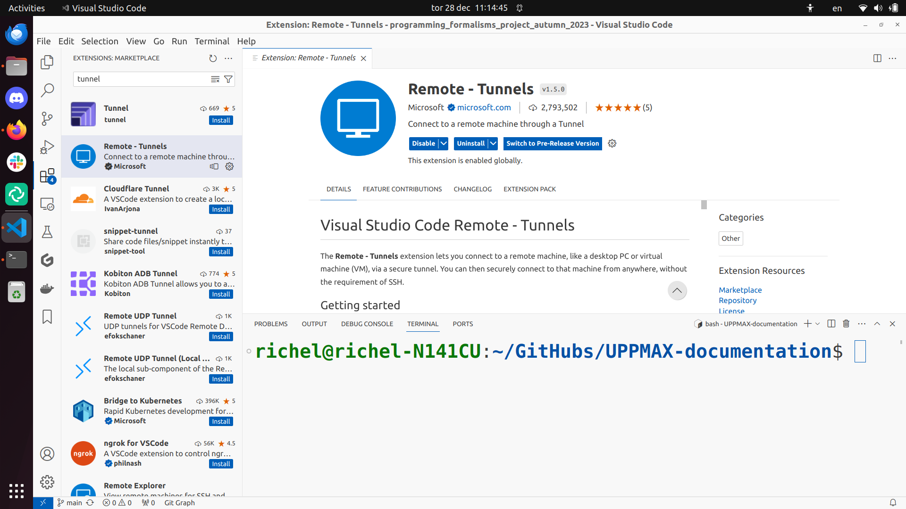

# Using Visual Studio Code on Rackham

> VSCode from a local computer working on Rackham.

## Introduction

Visual Studio Code ('VSCode') is an [IDE](../software/ides.md)
that can be used for software development in many languages.

???- tip "What is an IDE?"

    See [the page on IDEs](../software/ides.md).

In this session, we show how to use VSCode on Rackham.

## Procedure to start VSCode

### 1. Install VSCode on your local computer

### 2. Start VSCode on your local computer

### 3. In VSCode, install the VSCode 'Remote Tunnels' plugin

### 4. In VSCode, connect to Rackham

In VSCode, at the 'Remote Explorer' tab, click on '[SSH](../software/ssh.md)',
then on 'New Remote'.

Type `ssh [username]@rackham.uppmax.uu.se` 
where `[username]` is your UPPMAX username,
for example, `ssh sven@rackham.uppmax.uu.se`.

Use the `~/.ssh/config` file:

Click on 'Connect':

Now, you can work directly on your Rackham files!

