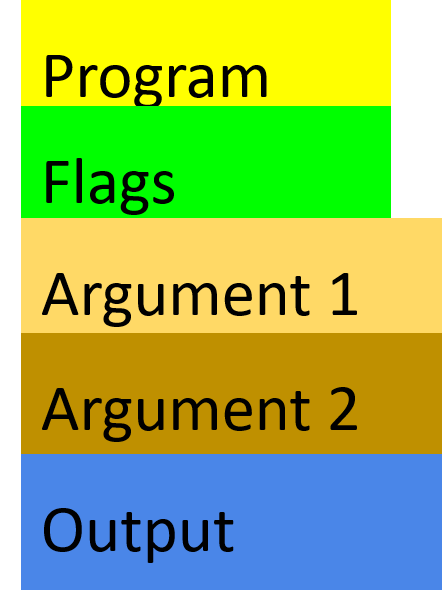
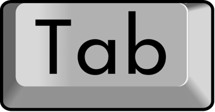

# Linux

- The "operating system" of the UPPMAX and most of the other clusters is **Linux**.

!!! questions

    - What is Linux?
    - How to use the command line?

!!! objectives

    - We'll briefly get an overview of Linux
    - How the command line works
    - Some text editors
    - Things to be aware of

???- question "Want a video?"

    [Here](https://youtu.be/oxCF4qr6EZo?si=ho7ry6hkFtkLwaxO) is video
    that gives an introduction to Linux

## What is Linux?


- Daily speaking: The Linux Operating system is a UNIX like and UNIX compatible Operating system.
- Linux is a "Kernel" on which many different programs can run.
- The shell (bash, sh, ksh, csh, tcsh and many more) is one such program.


- Actually, for it to be an OS, it is supplied with GNU software and other additions giving us the name **GNU/Linux**.
    - [Linux naming controversy](https://en.wikipedia.org/wiki/GNU/Linux_naming_controversy)


- Linux has a multiuser platform at its base which means permissions and security comes easy.

### Linux comes in different distributions, dialects or, say, flavours

- UPPMAX runs CentOS and RedHat


## Using the command line

Below usage of the command line is discussed in text.
If you prefer video, [here](https://youtu.be/kjqLAx2bgJI)
is how to use the command-line on the UPPMAX Bianca cluster.

### Command line with bash (Bourne Again Shell)

- A Unix shell and command language.
- Often default shell


- The command-line interface: the bash prompt $
- bash can be seen as a program that finds and runs other programs
- bash is scripting language that is referred to as a shell
    - (because it sits around the kernel making it easy to interact with)


### The prompt

```bash
[info]$ word1 word2 word3 [...]
```

- [info] is configurable, and usually tells you who you are, on what system, and where in the file system.

    - Example:

    ```bash
    [bjornc@rackham3 linux_tutorial]$
    ```

    - For changing info (only for advanced users!)  Does not matter for this course!:
        - <https://www.cyberciti.biz/tips/howto-linux-unix-bash-shell-setup-prompt.html>
    - The program to run is the first word
    - All words are separated by spaces


### Example bash command

{: style="width:300px"}

{ : style="width:200px" }

- Terminal screen shows

{ : style="width:500px" }


### Tab Completion


{ : style="width:200px" }

- Whenever you’re writing a path or filename on the bash prompt, you can strike the ‘tab’ key to
ask Bash to complete what you’re writing.

- Get in the habit of this — it will save you many hours!


## Editing files


To edit files, you will use a text editor.
The UPPMAX HPC clusters have multiple text editors installed,
which are described at the UPPMAX 'Text editors' page [here](../software/text_editors.md).

!!! example

    **Start nano and save a file called `first.txt`**
    ```console
    $ nano first.txt
    ```

    - Type `test text`
    - End and save with ``<ctrl>-X`` followed by `Y` and `<enter>`.


## Typical sources of error


!!! Warning
    - Capitalization matters in file names and program names
    - Spaces matter.
      - Always have a space after the program name.
      - Don’t add spaces within file names.
    - Check that you are in the right place in the file system.
    - File permissions. Check that the right read, write and execute permission are set. See next session.


## Caution


!!! Warning

    - There is no undo for:
      - copy (`cp`),
      - move (`mv`), and
      - remove (`rm`).
    - **Beware of overwriting files and deleting the wrong ones.**


!!! tip

    - **Tip: make "`rm`" ask if you really want to erase:**
      - Within a session: Type in the command prompt

            alias rm='rm -i'

      - Override asking with

            rm –f <>

      - Edit file `.bashrc` in `home` directory by adding the alias line for this to start everytime.
    - This will also work for ``mv`` and ``cp``!

!!! Note

    - If you do destroy your data, email UPPMAX support, we may be able to help.


!!! keypoints

    - Linux Operating system is a UNIX-like and UNIX compatible Operating system.
    - Typical command:
        $ program word1 word2 word3 […]
    - Use [text editors](../software/text_editors.md) to edit files
    - Tips
        - use Tab completion
        - capitalization and spaces matters
        - no undo:s for copying, moving and removing
          - Solution: ``alias rm='rm -i' ``


## Links

- A free online book about Linux: ['The Linux Command Line'](https://linuxcommand.org/tlcl.php).
