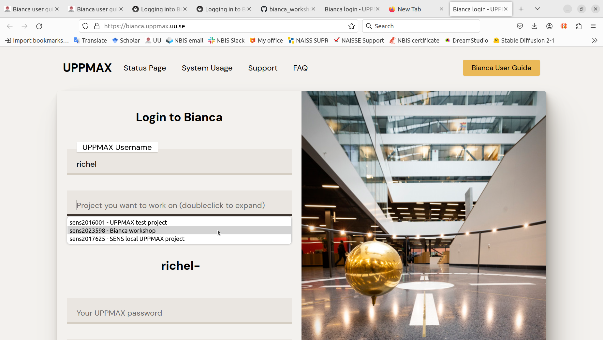
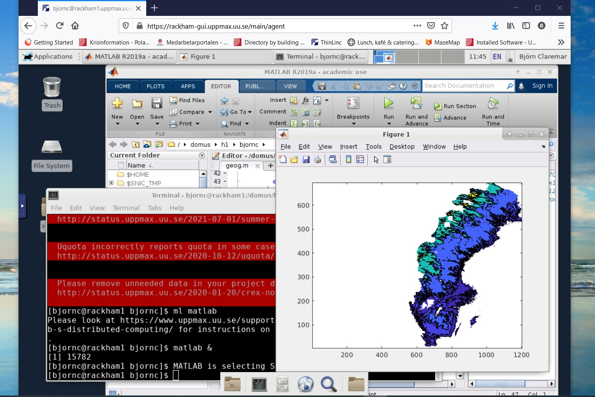

# Log in to Bianca

> The two Bianca environments to work on Bianca.
> At the left is a remote desktop environment.
> At the the right is the console environment.

Here it is described how to log in to [Bianca](../cluster_guides/bianca.md):

- [Bianca's design](../cluster_guides/biancas_design.md):
  helps understand why the procedure described here is needed.
- [Prerequisites](#prerequisites-for-using-bianca) describes what is needed before one can access Bianca
- [The two Bianca environments](#the-two-bianca-environments) shows the two ways to access Bianca
- [Get within the university networks](#get-within-the-university-networks) shows how *to be allowed to* access Bianca
- [Get inside the Bianca environment](#get-inside-the-bianca-environment) show how access the two Bianca environments:
    - [Login to the Bianca remote desktop environment](#login-to-the-bianca-remote-desktop-environment)
    - [Login to the Bianca console environment](#login-to-the-bianca-console-environment)

## Prerequisites for using Bianca

To be allowed to use Bianca, one needs all of these:

- [An active research project](#an-active-research-project)
- [An UPPMAX account](#an-uppmax-user-account)
- [An UPPMAX password](#an-uppmax-password)

These prerequisites are discussed in detail below.

### An active research project

One [prerequisite for using Bianca](#prerequisites-for-using-bianca)
is that you need to be a member of an active SNIC SENS
or SIMPLER research project (these are called `sens[number]` or `simp[number]`,
where `[number]` represent a number, for example `sens123456` or `simp123456`).

???- question "Forgot your Bianca projects?"

    One easy way to see your Bianca projects is to use the
    Bianca remote desktop login screen at <https://bianca.uppmax.uu.se/>.

    

[SUPR](https://supr.naiss.se/) (the 'Swedish User and Project Repository')
is the website that allows one to request access to Bianca
and to get an overview of the requested resources.

???- question "How does the SUPR website look like?"

    

    > First SUPR page

    

    > SUPR 2FA login. Use the SUPR 2FA (i.e. **not** UPPMAX)

After logging in, the [SUPR](https://supr.naiss.se/)
website will show all projects you are a member of,
under the 'Projects' tab.

???- question "How does the 'Projects' tab of the SUPR website look like?"

    

    > Example overview of SUPR projects

To see if a project has access to Bianca, click on the
project and scroll to the 'Resources' section. In the 'Compute' subsection,
there is a table. Under 'Resource' it should state 'Bianca @ UPPMAX'.

???- question "How does the 'Resources' page of an example project look like?"

    

    > The 'Resources' page of an example project.

Note that the 'Accounts' tab can be useful to verify your username.

???- question "How does the 'Accounts' tab help me find my username?"

    

    > An example of a SUPR 'Accounts' tab.
    > The example user has username `richel-sens2023598`,
    > which means his/her UPPMAX username is `richel`

You can become a member of an active SNIC SENS by:

- request membership to an existing project in SUPR
- create a project. See the UPPMAX page on
  how to submit a project application [here](project_apply.md)

### An UPPMAX user account

Another [prerequisite for using Bianca](#prerequisites-for-using-bianca)
is that you must have a personal UPPMAX user account.
This is separate from your SUPR account.
See the user account application page if you do not have one.

Once you are set up for login,
this should also be reflected in SUPR through
 one or several additional account(s)
at UPPMAX for the specific project(s) you are a member of.

### An UPPMAX password

Another [prerequisite for using Bianca](#prerequisites-for-using-bianca)
is that you need to know your UPPMAX password.
If you change it, it may take up to an hour before changes are reflected in Bianca.

For advice on handling sensitive personal data correctly on Bianca, see our FAQ page.

## The two Bianca environments

Bianca, like most HPC clusters, uses Linux.
To use Bianca, there are two environments:

???- question "How does the Bianca remote desktop look like?"

    One can pick multiple remote desktop environments,
    such as GNOME and XFCE (and KDE, don't pick KDE!).

    

    > The Bianca XFCE remote desktop environment

    

    > A more populated Bianca XFCE remote desktop

- A remote desktop environment, also called 'graphical environment',
  'GUI environment', '[ThinLinc](../software/thinlinc.md) environment'

???- question "How does the Bianca console environment look like?"

    

    > The Bianca console environment

- A console environment, also called 'terminal environment' or 'terminal'

The [remote desktop environment](../software/thinlinc.md) is considered the easier place to start for most
new users, as it has most similarities with what a new user is familiar with.
However, one must always use a terminal to some extent.

```mermaid
flowchart TD

    subgraph sub_bianca_private_env[The project's private virtual project cluster]
      bianca_private_console[Bianca console environment]
      bianca_private_remote_desktop[Bianca remote desktop]
      bianca_private_terminal[Terminal]
    end

    %% Private Bianca
    bianca_private_console---|is a|bianca_private_terminal
    bianca_private_remote_desktop-->|must also use|bianca_private_terminal
```

> The two Bianca environments and their relation to a terminal.

## Get within the university networks

Bianca has sensitive data.
To protect this data,
Bianca is accessible from all Swedish university networks.
To be precise, to connect to Bianca one needs to so from a
[SUNET](https://www.sunet.se/) Internet Protocol ('IP') address.

Due to this, the first step to access Bianca
is to get an IP that is inside SUNET first.

See the 'get inside the university networks' page [here](../getting_started/get_inside_sunet.md)

## Get inside the Bianca environment

???- question "Want a video?"

    - [Login to the Bianca remote desktop and Bianca console environment, physically inside SUNET](https://youtu.be/upBozh2BI5c?si=NXUHKyA1tNeZFeSR)
    - [Login to the Bianca remote desktop and Bianca console environment, outside of SUNET, use VPN](https://youtu.be/Ni9nyCf7me8?si=pL3Xna7XbV3G1QFi)
    - [Install VPN client, then login to the Bianca remote desktop using that VPN client](https://youtu.be/AIJKbJeu0MI?si=9ES3ZECykwc8tT28)
    - [Login to the Bianca remote desktop and Bianca console environment, outside of SUNET, no VPN](https://youtu.be/W-PMTyNcbYI?si=mT4h4utxH3owygAH)

When inside SUNET, one can access the Bianca environments.

- For a remote desktop environment,
  go to [login to the Bianca remote desktop environment](#login-to-the-bianca-remote-desktop-environment)
- For a console environment,
  go to [login to the Bianca console environment](#login-to-the-bianca-console-environment)

Below, the ways to access these Bianca environments
are discussed

```mermaid
flowchart TD

    subgraph sub_inside[IP inside SUNET]
      user(User)

      subgraph sub_bianca_shared_env[Bianca shared network]
        subgraph sub_bianca_private_env[The project's private virtual project cluster]
          bianca_private_console[Bianca console environment]
          bianca_private_remote_desktop[Bianca remote desktop]
        end
      end
    end

    %% Inside SUNET
    user --> bianca_private_console
    user --> bianca_private_remote_desktop
```

### Login to the Bianca remote desktop environment

One can only [access Bianca remote desktop environment via a website](login_bianca_remote_desktop_website.md).

???- question "Will a local ThinLinc client work too?"

    No. 

    One really can only [access Bianca remote desktop environment via a website](login_bianca_remote_desktop_website.md).

### Login to the Bianca console environment

When inside SUNET, one can access a Bianca console environment
using a terminal and the Secure Shell Protocol (SSH).

???- question "Forgot how to get within SUNET?"

    See the 'get inside the university networks' page [here](../getting_started/get_inside_sunet.md)

You can use your favorite terminal to login (see <https://uppmax.github.io/uppmax_intro/login2.html#terminals> for an overview of many)
to the Bianca command-line environment.
You can also have multiple log-ins active at once.

There are multiple ways to set this up:

- [Login to the Bianca console environment with a password](login_bianca_console_password.md).
- [Login to the Bianca console environment with an SSH key](login_bianca_console_ssh_key.md).

Using an SSH password is considered easiest,
where using an SSH key is considered more elegant.

In a Bianca console environment:

- Text display is limited to 50kBit/s.
  This means that if you create a lot of text output,
  you will have to wait some time before you get your prompt back.
- Cut, copy and paste work as usual.
  Be careful to not copy-paste sensitive data!

```mermaid
flowchart TD

    subgraph sub_inside[IP inside SUNET]

      user(User)

      subgraph sub_bianca_shared_env[Bianca shared network]
        bianca_shared_console[Bianca console environment login]
        subgraph sub_bianca_private_env[The project's private virtual project cluster]
          bianca_private_console[Bianca console environment]

          %% Ensure the innermost square gets big enough
          END:::hidden

        end
      end
    end

    %% Inside SUNET
    user-->|SSH, UPPMAX password and 2FA|bianca_shared_console

    bianca_shared_console --> |UPPMAX password or SSH key|bianca_private_console
```

## Overview of all steps possible/needed to access Bianca

```mermaid
flowchart TD

    subgraph sub_outside[IP outside SUNET]
      outside(Physically outside SUNET)
    end

    subgraph sub_inside[IP inside SUNET]
      physically_inside(Physically inside SUNET)
      inside_using_vpn(Inside SUNET using VPN)
      inside_using_rackham(Inside SUNET using Rackham)

      subgraph sub_bianca_shared_env[Bianca shared network]
        bianca_shared_console[Bianca console environment login]
        bianca_shared_remote_desktop[Bianca remote desktop login]
        subgraph sub_bianca_private_env[The project's private virtual project cluster]
          bianca_private_console[Bianca console environment]
          bianca_private_remote_desktop[Bianca remote desktop]
          bianca_private_terminal[Terminal]
        end
      end
    end

    %% Outside SUNET
    outside-->|Move physically|physically_inside
    outside-->|Use a VPN|inside_using_vpn
    outside-->|Login to Rackham|inside_using_rackham

    %% Inside SUNET
    physically_inside-->|SSH|bianca_shared_console
    physically_inside-->|UPPMAX website|bianca_shared_remote_desktop
    physically_inside-.->inside_using_rackham
    physically_inside-.->inside_using_vpn
    inside_using_vpn-->|SSH|bianca_shared_console
    inside_using_vpn-->|UPPMAX website|bianca_shared_remote_desktop
    inside_using_rackham-->|SSH|bianca_shared_console

    %% Shared Bianca
    bianca_shared_console --> |UPPMAX password|bianca_private_console
    bianca_shared_remote_desktop-->|UPPMAX password|bianca_private_remote_desktop

    %% Private Bianca
    bianca_private_console---|is a|bianca_private_terminal
    bianca_private_remote_desktop-->|must also use|bianca_private_terminal
```

This is an overview of all steps possible/needed to access Bianca.
It is all graphs on this pages combined.

