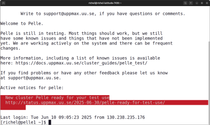

---
tags:
  - login
  - log in
  - Pelle
---

# Log in to Pelle

There are multiple UPPMAX clusters one can [log in to](../getting_started/login.md).
Here we describe how to log in to [Pelle](../cluster_guides/pelle.md).

!!! warning "Pelle is not ready yet"

    - Pelle is not completely ready yet,
    hence the content of this page will change.
    - Also, the content will be shorter and sloppier, until procedures
    solidify.
    - The instructions below will not work as of today.

!!! info "Test users are testing the Pelle environment"

    - We have pilot test users testing Pelle right now.
    - Soon all Pelle users will be let in.
    - In addition to SSH also ThinLinc will be available

- [Prerequisites](pelle_usage_prerequisites.md) describes what is needed before one can access Pelle
- [Which way to login?](#which-way-to-login)
    - [Website](login_pelle_remote_desktop_website.md)
    - [Terminal](login_pelle_console_password.md)
    - [Local ThinLinc client](login_pelle_remote_desktop_local_thinlinc_client.md)

## Which way to login?

There are multiple ways to log in to [Pelle](../cluster_guides/pelle.md):

Login                                                                         |Description                                   |Screenshot
------------------------------------------------------------------------------|----------------------------------------------|---------------------------------
:construction: [Website](login_pelle_remote_desktop_website.md)               |:construction: Does not work yet. Remote desktop, no installation needed, slow  |:construction: Under construction
[Terminal](login_pelle_console_password.md)                                   |Console environment, recommended              |
[Local ThinLinc client](login_pelle_remote_desktop_local_thinlinc_client.md)  |Remote desktop, recommended, need installation|

Here is a decision tree, to determine which way to log in:

```mermaid
flowchart TD
  need_gui(Need to run a graphical program?)
  use_terminal[Use a terminal]
  use_website[Use the remote desktop website]
  need_easy_or_speedy(Need easiest or fastest?)
  use_local[Use a local ThinLinc client]

  need_gui --> |no| use_terminal
  need_gui --> |yes| need_easy_or_speedy
  need_easy_or_speedy --> |easiest| use_website
  need_easy_or_speedy --> |fastest| use_local

  how_login(How to log in?)

  use_password[Use password. Start here]
  use_ssh_keys[Use SSH keys. No more password needed]

  use_terminal --> how_login
  how_login --> use_password
  how_login --> use_ssh_keys
```

The procedures can be found at:

- :construction: Does not work yet. [Login to the Pelle remote desktop environment using the website](login_pelle_remote_desktop_website.md)
- [Login to the Pelle console environment with a password](login_pelle_console_password.md).
  If you want to get rid of using a password every time, see [login to the Pelle console environment with an SSH key](login_pelle_console_ssh_key.md)
- [Login to the Pelle remote desktop environment using a local ThinLinc client](login_pelle_remote_desktop_local_thinlinc_client.md)

After login, you will be on a [login node](../cluster_guides/login_node.md).

!!! note "How to behave on a login node"

    On a login node, one can and should do simple things only:
    it is a resource shared with all other users on that node.

    If you need to do more intense calculations,
    [use the Slurm job scheduler](../cluster_guides/slurm_on_pelle.md).

    If you need to do more intense calculations interactively,
    [use an interactive session](../cluster_guides/start_interactive_session_on_pelle.md).
