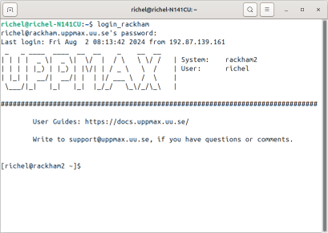

# Log in to Rackham

Here we describe how to log in to [Rackham](../cluster_guides/rackham.md).

- [Prerequisites](rackham_usage_prerequisites.md) describes what is needed before one can access Rackham
- [Which way to login?](#which-way-to-login)
    - [Website](login_rackham_remote_desktop_website.md)
    - [Terminal](login_rackham_console_password.md)
    - [Local ThinLinc client](login_rackham_remote_desktop_local_thinlinc_client.md)

## Prerequisites

## Which way to login?

There are multiple ways to log in to [Rackham](../cluster_guides/rackham.md):

Login                |Description                                   |Screenshot
---------------------|----------------------------------------------|---------------------------------
[Website](login_rackham_remote_desktop_website.md)              |Remote desktop, no installation needed, slow  |
[Terminal](login_rackham_console_password.md)             |Console environment, recommended              |
[Local ThinLinc client](login_rackham_remote_desktop_local_thinlinc_client.md)|Remote desktop, recommended, need installation|

Here is a decision tree, to determine which way to log in:

```mermaid
flowchart TD
  need_gui(Need to run a graphical program?)
  use_terminal[Use a terminal]
  use_website[Use the remote desktop website]
  need_easy_or_speedy(Need easiest or fastest?)
  use_local[Use a local ThinLinc client]

  need_gui --> |no| use_terminal
  need_gui --> |yes| need_easy_or_speedy
  need_easy_or_speedy --> |easiest| use_website
  need_easy_or_speedy --> |fastest| use_local

  how_login(How to log in?)

  use_password[Use password\nStart here]
  use_ssh_keys[Use SSH keys\nNo more password needed]

  use_terminal --> how_login
  how_login --> use_password
  how_login --> use_ssh_keys
```

The procedures can be found at:

- [Login to the Rackham remote desktop environment using the website](login_rackham_remote_desktop_website.md)
- [Login to the Rackham console environment with a password](login_rackham_console_password.md)
  If you want to get rid of using a password every time, see [login to the Rackham console environment with an SSH key](login_rackham_console_ssh_key.md)
- [Login to the Rackham remote desktop environment using a local ThinLinc client](login_rackham_remote_desktop_local_thinlinc_client.md)
