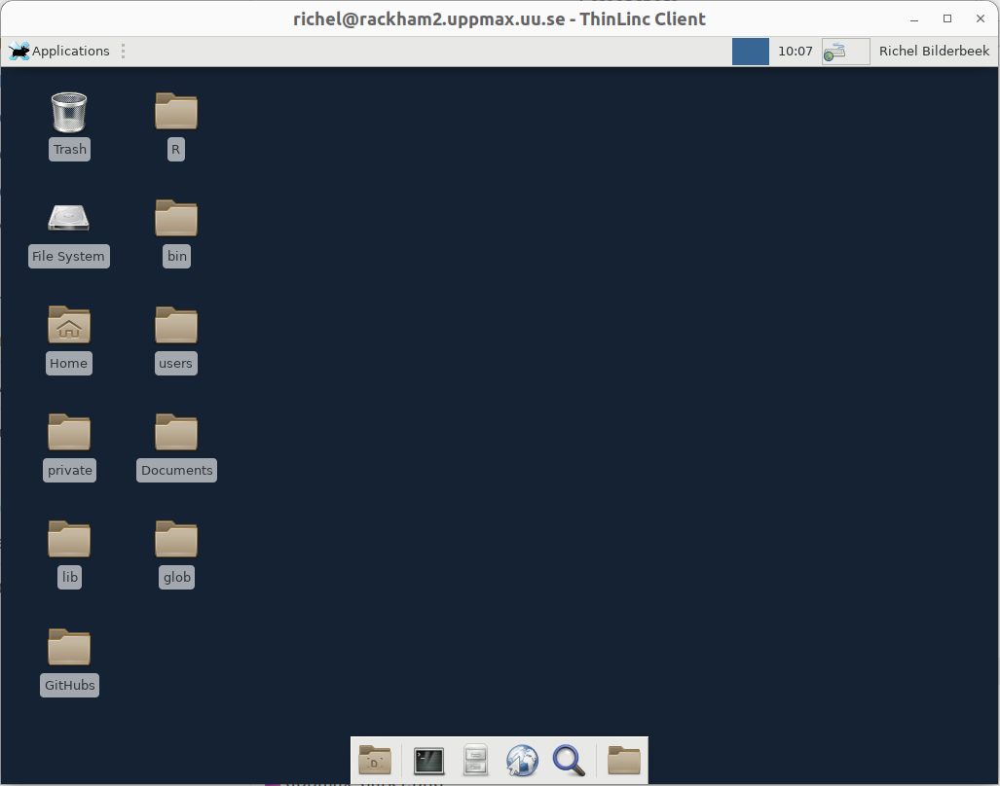

---
tags:
  - login
  - log in
  - Rackham
---

# Log in to Rackham

There are multiple UPPMAX clusters one can [log in to](../getting_started/login.md).
Here we describe how to log in to [Rackham](../cluster_guides/rackham.md).

- [Prerequisites](rackham_usage_prerequisites.md) describes what is needed before one can access Rackham
- [Which way to login?](#which-way-to-login)
    - [Website](login_rackham_remote_desktop_website.md)
    - [Terminal](login_rackham_console_password.md)
    - [Local ThinLinc client](login_rackham_remote_desktop_local_thinlinc_client.md)

## Which way to login?

There are multiple ways to log in to [Rackham](../cluster_guides/rackham.md):

Login                                                                         |Description                                   |Screenshot
------------------------------------------------------------------------------|----------------------------------------------|---------------------------------
[Website](login_rackham_remote_desktop_website.md)                            |Remote desktop, no installation needed, slow  |
[Terminal](login_rackham_console_password.md)                                 |Console environment, recommended              |
[Local ThinLinc client](login_rackham_remote_desktop_local_thinlinc_client.md)|Remote desktop, recommended, need installation|

Here is a decision tree, to determine which way to log in:

```mermaid
flowchart TD
  need_gui(Need to run a graphical program?)
  use_terminal[Use a terminal]
  use_website[Use the remote desktop website]
  need_easy_or_speedy(Need easiest or fastest?)
  use_local[Use a local ThinLinc client]

  need_gui --> |no| use_terminal
  need_gui --> |yes| need_easy_or_speedy
  need_easy_or_speedy --> |easiest| use_website
  need_easy_or_speedy --> |fastest| use_local

  how_login(How to log in?)

  use_password[Use password. Start here]
  use_ssh_keys[Use SSH keys. No more password needed]

  use_terminal --> how_login
  how_login --> use_password
  how_login --> use_ssh_keys
```

The procedures can be found at:

- [Login to the Rackham remote desktop environment using the website](login_rackham_remote_desktop_website.md)
- [Login to the Rackham console environment with a password](login_rackham_console_password.md).
  If you want to get rid of using a password every time, see [login to the Rackham console environment with an SSH key](login_rackham_console_ssh_key.md)
- [Login to the Rackham remote desktop environment using a local ThinLinc client](login_rackham_remote_desktop_local_thinlinc_client.md)

After login, you will be on a [login node](../cluster_guides/login_node.md).

!!! note "How to behave on a login node"

    On a login node, one can and should do simple things only:
    it is a resource shared with all other users on that node.

    If you need to do more intense calculations,
    [use the Slurm job scheduler](../cluster_guides/slurm_on_rackham.md).

    If you need to do more intense calculations interactively,
    [use an interactive session](../cluster_guides/start_interactive_session_on_rackham.md).

!!! note "About Rackham hostname"

    The hostname used to login via SSH is:

    rackham.uppmax.uu.se

    Note: This is a "round robin" address which will direct you to one of the physical login nodes, rackham1.uppmax.uu.se or rackham2.uppmax.uu.se, etc. (If needed, you can also login directly to one of these, by using their respective hostnames.)
