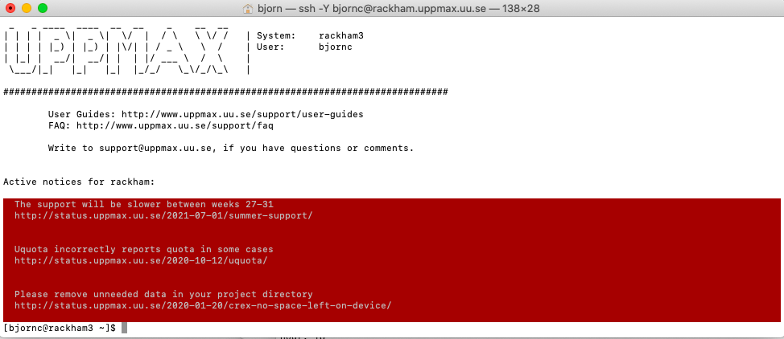
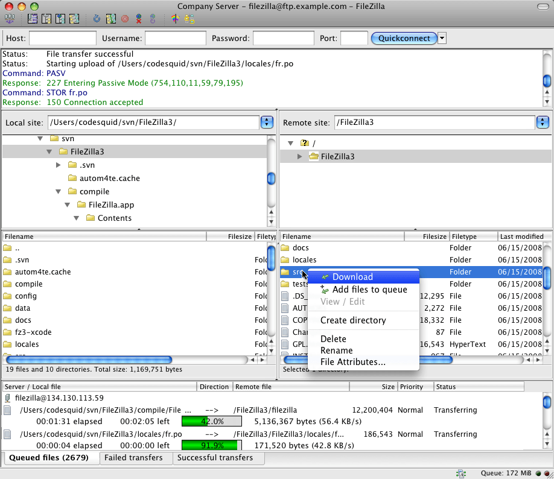

# Log in to Rackham

!!! info "Objectives"
    - We'll go through platform specific (Mac/Linux/Windows) ways to log in to UPPMAX
    - See different clients
    - Enable graphics

!!! warning
    - If you lack a user account, visit the [Getting started page](https://www.uppmax.uu.se/support/getting-started/course-projects/)

## General understanding

- When logging in to UPPMAX from your local computer you will arrive to your home folder at the login node.
- This means that only light analysis and and calculations should be made here.
- You will see this in the prompt after "@" as the clustername and a low number. For instance:

   ``` bash 
     [<user>@rackham3 ~]$
   ```
    
- You will later learn how to reach the calculation nodes. Then the prompt states the node number with a single letter, like "r" for Rackham. For instance:

   ``` bash
      [<user>@r484 ~]
   ```

!!! info "Quick start log in!"
    - Below you find how to log in
    - Further down we present other procedures to reach Rackham, depending on your planned work.
    

## Log in with a terminal, omitting support for graphics  

=== "Mac"

    - Start terminal (e.g. from Launchpad) or [iTerm2](https://iterm2.com/)
    
    ``` bash 
    $ ssh <username>@rackham.uppmax.uu.se
    ```
    
    - "< >" prompts you to set the keyword specific for you or your needs. In the example above, this is basically your username.

    <!--  -->

    - iTerm2 goodies:
    
       - You can save hosts for later.
       - Drag and drop scp
       
=== "Windows"

    - Start terminal (see below)
    
    ```bash
    $ ssh <username>@rackham.uppmax.uu.se
    ```
    
    - "< >" prompts you to set the keyword specific for you or your needs. In the example above, this is basically your username.

    

    - The ssh (secure shell) client [**putty**](https://www.putty.org/)

        - You can save hosts for later.
        - No graphics.
    
    - Windows Powershell terminal can also work

        - Cannot save hosts
        - no graphics
        - [PowerShell](https://learn.microsoft.com/en-us/powershell/)
    
    - Windows command prompt can also work

        - Cannot save hosts
        - no graphics
        - [Command Prompt](https://www.makeuseof.com/tag/a-beginners-guide-to-the-windows-command-line/)

    - [Git bash](https://gitforwindows.org/)


!!! info "Working on Rackham"    
    - Now we present alternatives to work on Rackham


## The login

!!! info "Login procedure"
    **Which login procedure is best for You, depends on:**
    
    - Your background
    - Your OS environment,
    - Your planned interaction with your local computer
    - Your planned use of graphics on the cluster

!!! info "Login procedure"

    If you plan to:
    
    - do **day-to-day** work where *terminal shell is sufficient*

        - Mac: *Terminal, iTerm2*
        - Linux: *Terminal*
        - Windows: *Putty*, *Windows Powershell* or even *command prompt (CMD)*
     
    - **interact with you local computer**
    
        - Mac/Linux: you can always work in a local shell (mutiple terminal windows open)
       
            - (S)FTP browser: *Filezilla*, *Cyberduck*
          
        - Windows
       
            - (S)FTP browser: *WinSCP*
            - *MobaXterm* has built-in SFTP browser
            - you may benefit from having a *Windows Subsystem for Linux, WSL(2)*       
        
    - **do day-to-day work** with **some graphical applications (X forwarding)**
    
        - Mac: *Terminal, iTerm2 + XQuartz*
        - Linux: *Terminal*
        - Windows: *MobaXterm*
     
     
    - integrate you cluster work with **code development**
    
        - All OS: Example *Visual Studio Code*
     
     
    - use **sophistic graphical interfaces** like *RStudio and MATLAB* etcetera
    
        - *ThinLinc application*
     
     
     
## Terminals (see above)

## Terminal with X11 server and light graphics

=== "Mac"

    - Download XQuartz or other X11 server for Mac OS
        - [https://www.xquartz.org/](https://www.xquartz.org/)

    - Start terminal (e.g. from Launchpad) or [iTerm2](https://iterm2.com/)

    ``` bash
    $ ssh -Y <username>@rackham.uppmax.uu.se
    ```
    
    - ``-X`` Enables X11 forwarding. 
    - ``-Y`` Enables trusted X11 forwarding.

=== "Windows"

    - Download and install ONE of the X-servers below (to enable graphics)
        - [GWSL](https://opticos.github.io/gwsl) (recommended because of hardware integration)
        - [X-ming](https://sourceforge.net/projects/xming/)
        - [VCXSRV](https://sourceforge.net/projects/vcxsrv/) 


    - or... 
    
    - Install a ssh (secure shell) program with built-in X11 and sftp file manager
        - [**MobaXterm**](https://mobaxterm.mobatek.net/)
        - sftp frame makes it easy to move, upload and download files.
        - ... though downloading from remote host to local is usually easier.
        - tabs for several sessions

    <!--  -->

    - Start local terminal and a SSH session by:

    ``` bash
    $ ssh -Y <username>@rackham.uppmax.uu.se
    ```
    
    - ``-X`` Enables X11 forwarding. 
    - ``-Y`` Enables trusted X11 forwarding.

    

    - Or even better, create and save a SSH session, as shown in image below.
        - This allows you to use MobaXterm as a file manager and  to use the built-in graphical texteditor.
        - You can rename the session in the Bookmark settings tab.

    


!!! note "X11-forwarding from the command line (generally)"

    - Graphics can be sent through the SSH connection you’re using to connect
      - Use primarily `ssh -Y <...>` or secondary `ssh -X <...>`

    - The X servers that enables graphics are needed, as mentioned above!
      - When starting a graphical program, a new window will open, but your terminal will be “locked”.
      - Run using "`&`" at the end to run it as a background process e.g. "`xeyes &`" or “`gedit &`”

    <!--  -->

    - Alternatively, use `<ctrl>-z` to put e.g. gedit to sleep and type "`bg`" to make last process in background.


???+ question "Test log in to **Rackham**, using your terminal"
    
    - First try:
    ``` bash
    $ ssh -Y <username>@rackham.uppmax.uu.se
    ```
    - If you receive errors or warnings, instead try:
    ``` bash
    $ ssh <username>@rackham.uppmax.uu.se
    ```
    - If you do have X11 installed:
    ``` bash
    $ xeyes &
    ```


## Graphical file manager

- This is good if you want to move many files between host and local and cannot use wildcards.


=== "Mac"

    - For copying of files with sftp (secure file transfer protocol) between your client computer (where you are) and the cluster **Filezilla** can be the choice.
    - [https://filezilla-project.org/download.php?type=client](https://filezilla-project.org/download.php?type=client)
 

    - 

    - [Cyberduck](https://cyberduck.io/)

=== "Windows"

    - For copying of files between your client computer (where you are) and the cluster **WinSCP** can also be the choice.
         - [https://winscp.net/eng/download.php](https://winscp.net/eng/download.php) 

    - 
    
    - [Cyberduck](https://cyberduck.io/)

    - [Filezilla](https://filezilla-project.org/download.php?type=client)


## Linux on your computer

!!! abstract "Local Linux environment"
    - You may sometimes benefit from having a local Linux environment.
    - Examples:
        - Mimic cluster environment to work with your local files and data as on the Cluster
        - get used to Linux (!)
    - Mac is UNIX and very Linux-like
    - Windows requires WSL (Windows subsystem for Linux)


??? question "For windows users who wants to get started with WSL (not covered here)"
    - Install WSL (Windows Subsystem for Linux) 
        - https://docs.microsoft.com/en-us/windows/wsl/install-win10 (Links to an external site.)
        - Don’t forget to update to wsl2
    - Install a distribution or a ssh (secure shell) program
        - Distribution such as ubuntu or
        - (recommended) a ssh program such as MobaXTerm
        - https://mobaxterm.mobatek.net/ (Links to an external site.)
            - sftp frame makes it easy to move, upload and download files.
    - You may want to check this webpage as well!
        - https://hackmd.io/@pmitev/Linux4WinUsers (Links to an external site.)

 
## Visual Studio Code (not covered here)

- intergrate you cluster work with *code development*
- [SSH-remote from VS Code](https://code.visualstudio.com/docs/remote/remote-overview)
- [Remote development using Visual Studio Code on Alvis cluster](https://www.c3se.chalmers.se/documentation/remote-vscode/remote_vscode/) 
  - Similar to Rackham. Just change login details!

 
## ThinLinc (all platforms!)

- This gives you a desktop environment, as if you were working on your own computer!
- On web:
  - [https://rackham-gui.uppmax.uu.se](https://rackham-gui.uppmax.uu.se)
- Or use the client 
  - [https://www.cendio.com/thinlinc/download](https://www.cendio.com/thinlinc/download)


!!! abstract "keypoints"
    - When you log in from your local computer you will always arrive at a login node with limited resources. 
         - You reach the calculations nodes from within the login node (See  Submitting jobs section)
    - You reach UPPMAX clusters either using a terminal client or Thinlinc
    - Graphics are included in Thinlinc and from terminal if you have enabled X11.
    - Which client to use?
    - Graphics and easy to use
        - ThinLinc
    - Best integrated systems
        - Visual Studio Code has several extensions (remote, SCP, programming IDE:s)
        - Windows: MobaXterm is somewhat easier to use.

