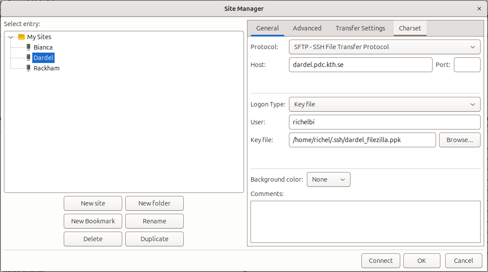

---
tags:
  - FileZilla
  - Dardel
---

# File transfer to/from Dardel using FileZilla

???- question "Why is this page at UPPMAX?"

    It is the intention that this guide is moved to the PDC documentation.
    However, it has not been suggested to be added to their documentaton
    yet.

HPC clusters have different ways to do
[file transfer using FileZilla](file_transfer_using_filezilla.md).

This page shows how to do so for Dardel.


> FileZilla connected to Dardel

## Procedure

???- question "Would you like a video?"

    If you like to see how to do file transfer from/to Dardel
    using FileZilla, watch the video [here](https://youtu.be/_3EmkN619Xo)

FileZilla is a secure file transfer tool that works under Linux,
Mac and Windows.

To transfer files to/from Dardel using FileZilla, do
the following steps:

### 1. Install `putty-tools`

???- question "What if I don't use Linux?"

    Instead of following steps 1 and 2, follow the procedure at
    [the puttygen page, section 'Create SSH key files'](../software/puttygen.md#create-ssh-key-files).

On Linux, do:

```bash
sudo apt install putty-tools
```

### 2. Create the needed files in the `.ssh` folder

Navigate into the `.ssh` folder.

```bash
cd .ssh
```

#### 2.1 Create the `.ppk` file

In the `.ssh` folder, from a terminal do:

```bash
puttygen -t rsa -b 2048 -C "[dardel_username]@dardel.pdc.kth.se" -o [filename].ppk
```

For example:

```bash
puttygen -t rsa -b 2048 -C "svensv@dardel.pdc.kth.se" -o dardel_filezilla.ppk
```

#### 2.2 Extract the private SSH key from the `.ppk` file

In the `.ssh` folder, from a terminal do:

```bash
puttygen -O private-openssh-new [filename].ppk -o [filename]
```

For example:

```bash
puttygen -O private-openssh-new dardel_filezilla.ppk -o dardel_filezilla
```

#### 2.2 Extract the public SSH key from the `.ppk` file

In the `.ssh` folder, from a terminal do:

```bash
puttygen -O public-openssh [filename].ppk -o [filename].pub
```

For example:

```bash
puttygen -O public-openssh dardel_filezilla.ppk -o dardel_filezilla.pub
```

### 3. Upload the public SSH key into [the PDC Login Portal](https://loginportal.pdc.kth.se/)

Upload the public SSH key into [the PDC Login Portal](https://loginportal.pdc.kth.se/).

### 4. Start FileZilla

Start FileZilla.

### 5. Start FileZilla's site manager

From the menu, select 'File | Site manager'

???- tip "Where is that?"

    It is here:

    

    > The FileZilla 'File' menu contains the item 'Site manager'

### 6. Add a new site in FileZilla's site manager

In FileZilla's site manager, click 'New site'

???- tip "Where is that?"

    It is here:

    

### 7. Setup the site

In FileZilla's site manager:

- create a name for the site, e.g. `Dardel`.
- for that site, use all standards, except:
    - Set protocol to 'SFTP - SSH File Transfer Protocol'
    - Set host to `dardel.pdc.kth.se`
    - Set user to `[username]`, e.g. `svensv`
    - Set logon type: Key file
    - Upload the key file at `/.ssh/dardel_filezilla.ppk`
      from you local's computer

???- tip "How does that look like?"

    It looks similar to this:

    

### 8. Connect to the site

Click 'Connect'.

### 9. Ready to transfer files

Now you can transfer files between your local computer and Dardel.

???- tip "How does that look like?"

    It looks like this:

    
