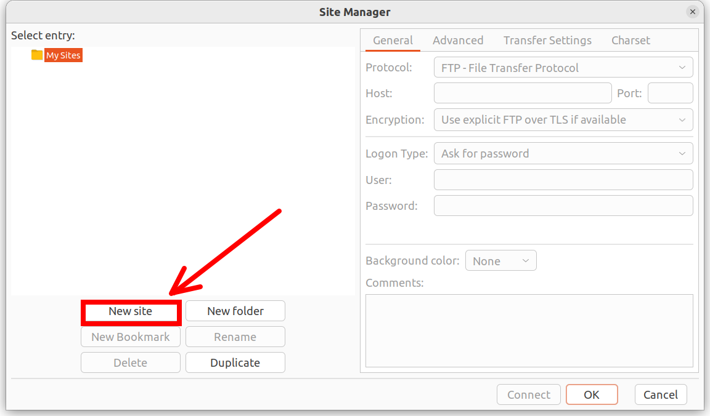
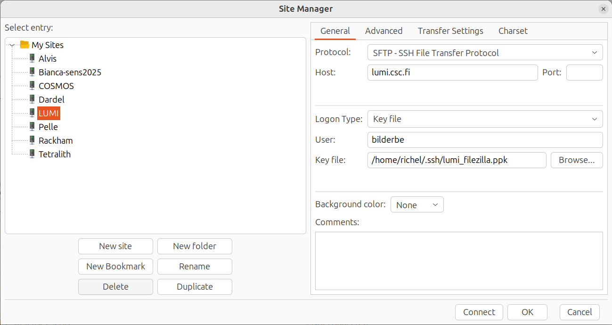

---
tags:
  - FileZilla
  - LUMI
  - file transfer
  - data transfer
  - upload
  - download
---

# File transfer to/from LUMI using FileZilla

???- question "Why is this page at UPPMAX?"

    It was the intention that this guide
    would be moved to the CSC documentation.
    However, contacting CSC regarding this,
    made it clear that
    [CSC does not (yet) intend to document this](https://github.com/UPPMAX/naiss_file_transfer_course/issues/34#issuecomment-2889764104).

HPC clusters have different ways to do
[file transfer using FileZilla](file_transfer_using_filezilla.md).

This page shows how to do so for LUMI.


## Procedure

???- question "Would you like a video?"

    Watch the YouTube video
    [File transfer to/from LUMI using FileZilla](https://youtu.be/PjzMuMIyj40)

FileZilla is a secure file transfer tool that works under Linux, Mac and Windows.

To transfer files to/from LUMI using FileZilla, do
the following steps:

## 1. Install `putty-tools`

???- question "What if I don't use Linux?"

    Instead of following steps 2 and 3, follow the procedure at
    [the puttygen page, section 'Create SSH key files'](../software/puttygen.md#create-ssh-key-files).


```bash
sudo apt install putty-tools
```

## 2. Create the needed files in the `.ssh` folder

Navigate into the `.ssh` folder.

```bash
cd .ssh
```

## 3. Create the `.ppk` file

In the `.ssh` folder, from a terminal do:

```bash
puttygen -t rsa -b 4096 -C "[lumi_username]@lumi.csc.fi" -o [filename].ppk
```

For example:

```bash
puttygen -t rsa -b 4096 -C "svens@lumi.csc.fi" -o lumi_filezilla.ppk
```

## 4. Extract the private SSH key from the `.ppk` file

In the `.ssh` folder, from a terminal do:

```bash
puttygen -O private-openssh-new [filename].ppk -o [filename]
```

For example:

```bash
puttygen -O private-openssh-new lumi_filezilla.ppk -o lumi_filezilla
```

## 5. Extract the public SSH key from the `.ppk` file

In the `.ssh` folder, from a terminal do:

```bash
puttygen -O public-openssh [filename].ppk -o [filename].pub
```

For example:

```bash
puttygen -O public-openssh lumi_filezilla.ppk -o lumi_filezilla.pub
```

## 6. Add the public SSH key to `~/.ssh/authorized_keys`

Copy the public SSH key (in the `.pub` file)
to the `~/.ssh/authorized_keys` file on LUMI.

If that file does not exist yet, create it and set the right
permissions as such:

```bash
mkdir .ssh
touch .ssh/authorized_keys
chmod 700 .ssh/authorized_keys
chmod 700 .ssh
chmod 700 ~
```

## 7. Start FileZilla

Start FileZilla.

## 8. Start FileZilla's site manager

From the menu, select 'File | Site manager'

???- tip "Where is that?"

    It is here:

    

    > The FileZilla 'File' menu contains the item 'Site manager'

## 9. Add a new site in FileZilla's site manager

In FileZilla's site manager, click 'New site'

???- tip "Where is that?"

    It is here:

    

## 10. Setup the site

In FileZilla's site manager:

- create a name for the site, e.g. `LUMI`.
- for that site, use all standards, except:
    - Set protocol to 'SFTP - SSH File Transfer Protocol'
    - Set host to `lumi.csc.fi`
    - Set user to `[username]`, e.g. `svensson`
    - Set logon type: Key file
    - Upload the key file at `/.ssh/lumi_filezilla.ppk`
      from you local's computer

???- tip "How does that look like?"

    It looks similar to this:

    

## 11. Connect to the site

Click 'Connect'.

## 12. Ready to transfer files

Now you can transfer files between your local computer and LUMI.


