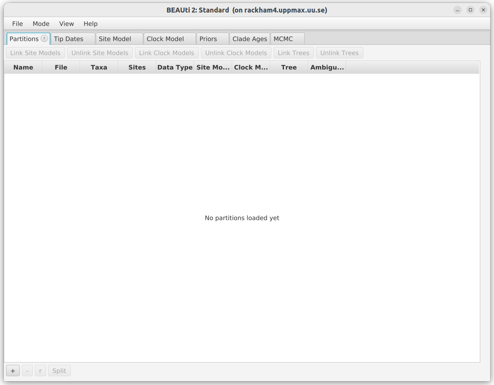
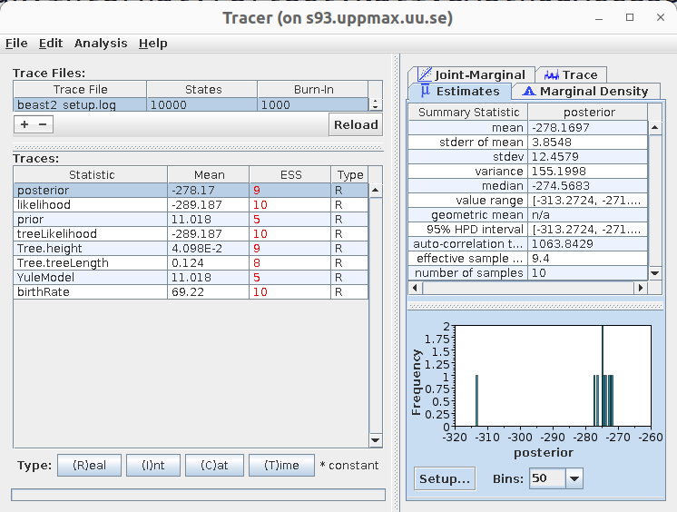

# BEAST2

BEAST2 is a tool for Bayesian phylogenetic analysis.

???- question "Is BEAST2 a new version of BEAST?"

    No. 

    Although BEAST and BEAST2 achieve a similar goal,
    BEAST and BEAST2 are developed independently.

    Hence, 
    - there are things BEAST can do that BEAST2 cannot, and vice versa
    - one cannot create a BEAST XML file and expect BEAST2 to be able to run it, and vice versa

## Using BEAST2

Here is how to use BEAST2 on the UPPMAX clusters.

???- question "Prefer a video?"

    [This YouTube video](https://youtu.be/Z6LcFE5p5S0) shows
    how to use BEAST2 on the UPPMAX clusters. 

## 1. Load a `beast2` module

First step is to load a BEAST2 module.

Here is how to find the BEAST2 versions on the UPPMAX clusters:

```
module spider beast2
```

When loading a BEAST2 module, also load `bioinfo-tools`:

```
module load bioinfo-tools beast2/2.7.4
```

???- question "How does that look like?"

    ```
    $ module load bioinfo-tools beast2/2.7.4
    beast2/2.7.4: Also loaded beagle/4.0.0
    beast2/2.7.4: Many Beast packages are available, to see the list, 'packagemanager -list'
    beast2/2.7.4: Use BEAST_XMX to specify the amount of RAM (default 5g), 'export BEAST_XMX=15g'. Do not exceed RAM available to your job.
    ```

## 2. Run `BEAUti`

Next step is to create a BEAST2 configuration file
using `BEAUti`. This graphical tool can be started using:

```
beauti
```

As `BEAUti` is a graphical program,
it needs [SSH with X forwarding enabled](../software/ssh_x_forwarding.md) enabled.

???- question "How does that look like?"

    Starting `BEAUti` results in the following pop-up window:

    

After using `BEAUti`, save the file with your BEAST2 model.

## 3. Run 

A BEAST2 run takes a lot of computing power,
hence do not run it on a login node.
Instead, run it on an interactive node 
or use a script.

???- question "How to start an interactive node?"

    View the UPPMAX documentation
    ['How to start an interactive node on Rackham'](../cluster_guides/start_interactive_node_on_rackham).


On an interactive node, run BEAST2 on the saved BEAST2 model:

```
beast beast2_setup.xml
```

When using a script, put that line in a script.
Below is an example script, called `run_beast2.sh`:

```bash title="run_beast2.sh"
#!/bin/bash
#SBATCH -A uppmax2023-2-25
module load bioinfo-tools beast2/2.7.4
beast beast2_setup.xml
```

 * In line 2, replace `uppmax2023-2-25` with [your UPPMAX project](../getting_started/project.md).
 * In line 3, you may want to replace `beast2/2.7.4` with your favorite BEAST2 version

Then run this script using `sbatch run_beast2.sh`.

Note that this is a *minimal* script.
See [the UPPMAX documentation on Slurm](../cluster_guides/slurm.md)
for ways to improve this script.

## View the trees using DensiTree

DensiTree is a tool that allows one to display the posterior tree distribution
of a BEAST2 run.

Run:

```
densitree [trees_filename]
```

where `[trees_filename]` is the name of the file containing the posterior trees,
resulting in, for example, `densitree my_file.trees`.


## Run Tracer

[Tracer](tracer.md) is a tool to analyse the results of a
([BEAST](beast.md) or) [BEAST2](beast2.md) run.

See [Tracer](tracer.md) how to use [Tracer](tracer.md).



## Show info

```
beast -beagle_info
```

???- "How does that look like?"

    Here the command is run on a [Rackham](../cluster_guides/rackham.md) 
    compute node, using an interactive session.

    Here an interactive session with 1 node:

    ```
    interactive -A uppmax2023-2-25 -M snowy -N 1 -n 16 --exclusive -t 1-00:00:00
    ```

    ```
    [richel@s93 ~]$ beast -beagle_info

                            BEAST v2.7.4, 2002-2023
                 Bayesian Evolutionary Analysis Sampling Trees
                           Designed and developed by
     Remco Bouckaert, Alexei J. Drummond, Andrew Rambaut & Marc A. Suchard
                                        
                       Centre for Computational Evolution
                             University of Auckland
                           r.bouckaert@auckland.ac.nz
                            alexei@cs.auckland.ac.nz
                                        
                       Institute of Evolutionary Biology
                            University of Edinburgh
                               a.rambaut@ed.ac.uk
                                        
                        David Geffen School of Medicine
                     University of California, Los Angeles
                               msuchard@ucla.edu
                                        
                          Downloads, Help & Resources:
                               http://beast2.org/
                                        
      Source code distributed under the GNU Lesser General Public License:
                       http://github.com/CompEvol/beast2
                                        
                               BEAST developers:
       Alex Alekseyenko, Trevor Bedford, Erik Bloomquist, Joseph Heled, 
     Sebastian Hoehna, Denise Kuehnert, Philippe Lemey, Wai Lok Sibon Li, 
    Gerton Lunter, Sidney Markowitz, Vladimir Minin, Michael Defoin Platel, 
              Oliver Pybus, Tim Vaughan, Chieh-Hsi Wu, Walter Xie
                                        
                                   Thanks to:
              Roald Forsberg, Beth Shapiro and Korbinian Strimmer


    --- BEAGLE RESOURCES ---

    0 : CPU (x86_64)
        Flags: PRECISION_SINGLE PRECISION_DOUBLE COMPUTATION_SYNCH EIGEN_REAL EIGEN_COMPLEX SCALING_MANUAL SCALING_AUTO SCALING_ALWAYS SCALERS_RAW SCALERS_LOG VECTOR_SSE VECTOR_NONE THREADING_CPP THREADING_NONE PROCESSOR_CPU FRAMEWORK_CPU
    ```

    Here an interactive session with 2 nodes:

    ```
    interactive -A uppmax2023-2-25 -M snowy -N 2 -n 32 --exclusive -t 1-00:00:00
    ```

    ```
    [richel@s106 ~]$ beast -beagle_info

                            BEAST v2.7.4, 2002-2023
                 Bayesian Evolutionary Analysis Sampling Trees
                           Designed and developed by
     Remco Bouckaert, Alexei J. Drummond, Andrew Rambaut & Marc A. Suchard
                                        
                       Centre for Computational Evolution
                             University of Auckland
                           r.bouckaert@auckland.ac.nz
                            alexei@cs.auckland.ac.nz
                                        
                       Institute of Evolutionary Biology
                            University of Edinburgh
                               a.rambaut@ed.ac.uk
                                        
                        David Geffen School of Medicine
                     University of California, Los Angeles
                               msuchard@ucla.edu
                                        
                          Downloads, Help & Resources:
                               http://beast2.org/
                                        
      Source code distributed under the GNU Lesser General Public License:
                       http://github.com/CompEvol/beast2
                                        
                               BEAST developers:
       Alex Alekseyenko, Trevor Bedford, Erik Bloomquist, Joseph Heled, 
     Sebastian Hoehna, Denise Kuehnert, Philippe Lemey, Wai Lok Sibon Li, 
    Gerton Lunter, Sidney Markowitz, Vladimir Minin, Michael Defoin Platel, 
              Oliver Pybus, Tim Vaughan, Chieh-Hsi Wu, Walter Xie
                                        
                                   Thanks to:
              Roald Forsberg, Beth Shapiro and Korbinian Strimmer


    --- BEAGLE RESOURCES ---

    0 : CPU (x86_64)
        Flags: PRECISION_SINGLE PRECISION_DOUBLE COMPUTATION_SYNCH EIGEN_REAL EIGEN_COMPLEX SCALING_MANUAL SCALING_AUTO SCALING_ALWAYS SCALERS_RAW SCALERS_LOG VECTOR_SSE VECTOR_NONE THREADING_CPP THREADING_NONE PROCESSOR_CPU FRAMEWORK_CPU
    ```

## Troubleshooting

### BEAUti gives `BadAlloc`

 * Platform(s): MacOS

This problem seems to be related to not having a proper X server installed.
In this case, [SSH X forwarding](ssh_x_forwarding.md) works to the extent
that SSH is able to show `xeyes`, yet fails to show BEAUti.
Also, [using the remote desktop via a ThinLinc client](../getting_started/login_rackham.md#remote-desktop-via-a-ThinLinc client) fails.

A solution may be to [use the remote desktop via the web](../getting_started/login_rackham.md#remote-desktop-via-the-web)

???- question "How does that look like?"

    Here is how it looks like:

    ```
    [kayakhi@rackham2 ~]$ xeyes

    [kayakhi@rackham2 ~]$ module load bioinfo-tools beast2/2.7.4

    beast2/2.7.4: Also loaded beagle/4.0.0

    beast2/2.7.4: Many Beast packages are available, to see the list, 'packagemanager -list'

    beast2/2.7.4: Use BEAST_XMX to specify the amount of RAM (default 5g), 'export BEAST_XMX=15g'. Do not exceed RAM available to your job.

    [kayakhi@rackham2 ~]$ beauti

    X Error of failed request:  BadAlloc (insufficient resources for operation)

      Major opcode of failed request:  149 (GLX)

      Minor opcode of failed request:  5 (X_GLXMakeCurrent)

      Serial number of failed request:  0

      Current serial number in output stream:  32
    ```

    Note that this user has enabled [SSH X forwarding](ssh_x_forwarding.md),
    as is proven by calling `xeyes` without problems.

## Optimize performance

 * [BEAST2 performance suggestions](https://www.beast2.org/performance-suggestions/index.html)
 * [BEAST2 and BEAGLE](https://www.beast2.org/beagle-beast-2-in-cluster/index.html)

## Links

 * [DensiTree GitHub repository](https://github.com/rbouckaert/DensiTree)
 * [CIPRES: cyberinfrastructure for phylogenetics research](https://www.phylo.org/)
