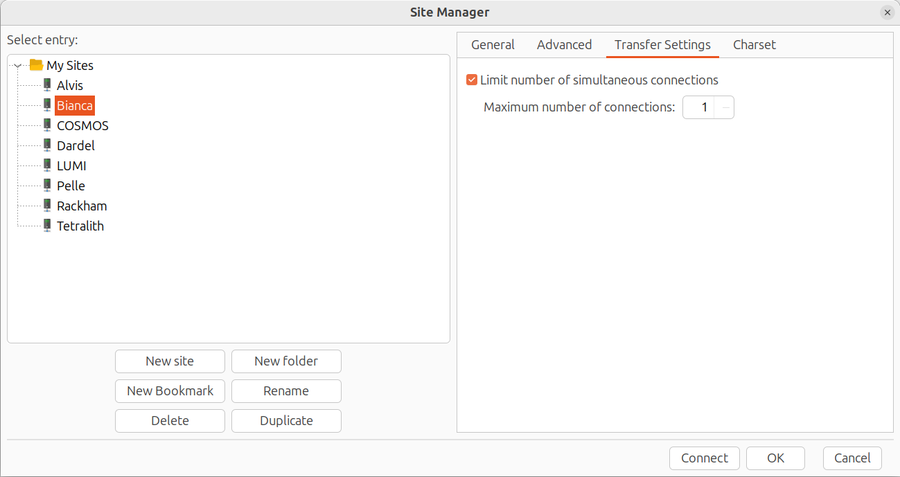

---
tags:
  - FileZilla
  - Bianca
  - data transfer
  - file transfer
  - transfer
  - visual
  - graphical
  - GUI
---

# File transfer to/from Bianca using FileZilla


> FileZilla connected to Bianca

There are multiple ways to [transfer data to/from Bianca](../cluster_guides/transfer_bianca.md).

Here, we show how to transfer files using a graphical tool called "FileZilla".
See [the UPPMAX page on 'FileZilla'](filezilla.md) on how to download and install it.

## Procedure

???- question "Would you like a video?"

    See the YouTube video
    [file transfer from/to Bianca using FileZilla](https://youtu.be/DYPWawyK5UE).


To transfer files to/from Bianca using FileZilla, do the following steps:

## 1. Get inside SUNET

Check how to get inside university networks : [Get inside of SUNET](../getting_started/get_inside_sunet.md).
If you are part of a Swedish university, you can use the VPN provided by your university.

## 2. Start FileZilla

Open FileZilla application.

## 3. Select 'File | Site manager'

In FileZilla, from the menu, select 'File | Site manager'.

???- question "Where is that?"

    It is here:

    

    > The FileZilla 'File' menu contains the item 'Site manager'

## 4. Click 'New site'

In the 'Site Manager' dialog, click 'New site'

???- question "Where is that?"

    It is here:

    

    > 'New site' can be found at the bottom-left

## 5. Create a name for the site

In the 'New Site' dialog, create a name for the site, e.g. `bianca`.

## 6. Configure site

In the 'New Site' dialog, make the following changes:

- Set 'protocol' to 'SFTP - SSH File Transfer Protocol'
- Set 'host' to `bianca-sftp.uppmax.uu.se`
- Set 'Logon type' to `Interactive`
  <!-- until September 2025, this was to be set to `Ask for Password` -->
- Set 'user' to your UPPMAX username, e.g. `sven`

## 7. Limit the number of simultaneous connections

In the dialog of the Bianca site, click on 'Transfer Settings'
and check 'Limit the number of simultaneous connections' to one.

???- question "Where is that?"

    It is here:

    

    > click on 'Transfer Settings' and check 'Limit the number of simultaneous
    > connections' to one.

???- question "Why is this important?"

    If you transfer multiple files and allow multiple simultaneous connections,
    FileZilla will ask you for a password per connection.

    Maybe you prefer to only type your password only once :-)


## 8. Click 'Connect'

In FileZilla, click 'Connect'

You will be asked for your password first. Enter your UPPMAX password. `
Then you will be asked for your second factor. Enter your 6 digit UPPMAX TOTP 2FA code.

!!! tip "Remembering/storing a password is useless"

    Because Bianca holds sensitive data,
    there is need to use the UPPMAX two-factor authentication
    code that changes every 30 seconds, every time you login.
    Due to this, storing a password is useless.

Now you can transfer files between your local computer and your [`wharf` folder](../cluster_guides/wharf.md).

???- question "How does that look like?"

    It looks like this:

    

    > FileZilla is ready to transfer files

## Troubleshooting

## Access denied

Full error, in the FileZilla terminal:

```text
Status: Connecting to bianca-sftp.uppmax.uu.se...

Status: Using username "sven".

Status: Access denied

Error: Authentication failed.

Error: Critical error: Could not connect to server
```

Hypotheses:

- The user is not within SUNET

???- question "How do I know if I am within the university networks?"

    If you login via `eduroam` you are within the university networks.

    When unsure, go to the Bianca remote desktop website at
    [https://bianca.uppmax.uu.se](https://bianca.uppmax.uu.se):
    if this page does not load, you are outside of the university networks.

    See [How to get inside of the university networks](../getting_started/get_inside_sunet.md)
    if you outside of the university networks.

- The account is not active

???- question "How do I know if the Bianca project is active?"

    A quick way to confirm your Bianca project is active:
    go to <https://bianca.uppmax.uu.se>
    and type your username. If the project is displayed, it is active.

    To confirm your project is active or inactive, use the SUPR NAISS website.
    See [the UPPMAX documentation on projects](../getting_started/project.md)
    how to see if your project is active?

- The user is not a member of the Bianca project

???- question "How do I know if I am a member of the Bianca project?"

    A quick way to confirm you are a member of the Bianca project:
    go to <https://bianca.uppmax.uu.se>
    and type your username. If the project is displayed,
    you are a member of the Bianca project.

    To confirm your project is active or inactive, use the SUPR NAISS website.
    See [the UPPMAX documentation on projects](../getting_started/project.md)
    how to see which projects you are a member of.

See [the UPPMAX page on contacting support](../support.md)
on how to contact us.
