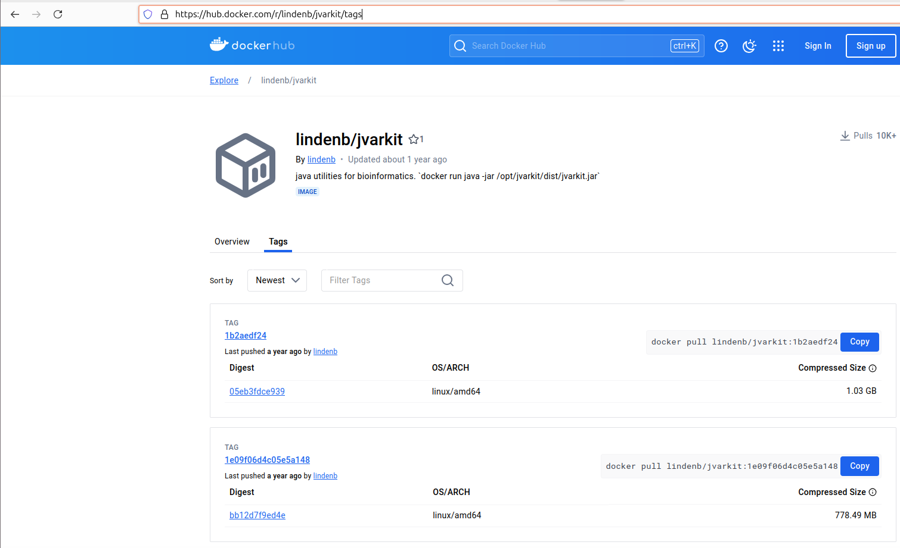

# Create a Singularity container from DockerHub

This page shows how to create a Singularity container from a Docker script on DockerHub.

## Procedure

The hardest part of this procedure may be to have
Linux with Singularity installed on a computer where you have
super-user rights.

In this example, we create a Singularity container
for [https://github.com/lindenb/jvarkit](https://github.com/lindenb/jvarkit)
with a DockerHub script at [https://hub.docker.com/r/lindenb/jvarkit](https://hub.docker.com/r/lindenb/jvarkit).


## 1. Create the Singularity container

Here we build a Singularity container from a Docker file:

```bash
sudo singularity build my_container.sif docker:[owner/file]
```

The magic is in `docker:[owner/file]`, which for us
becomes `docker:lindenb/jvarkit`:

```bash
sudo singularity build my_container.sif docker:lindenb/jvarkit
```

In some case, the Singularity container is now created.

???- question "How does that look like?"

    ```bash
    $ sudo singularity build my_container.sif docker:lindenb/jvarkit
    INFO:    Starting build...
    INFO:    Fetching OCI image...
    28.2MiB / 28.2MiB [================================================================================================================================================] 100 % 2.5 MiB/s 0s
    1.0GiB / 1.0GiB [==================================================================================================================================================] 100 % 2.5 MiB/s 0s
    INFO:    Extracting OCI image...
    INFO:    Inserting Singularity configuration...
    INFO:    Creating SIF file...
    INFO:    Build complete: my_container.sif
    ```

### 1.1 Troubleshooting

In our case, however, we get the `MANIFEST_UNKNOWN` error:

```bash
[sudo] password for sven: 
INFO:    Starting build...
INFO:    Fetching OCI image...
FATAL:   While performing build: conveyor failed to get: GET https://index.docker.io/v2/lindenb/jvarkit/manifests/latest: MANIFEST_UNKNOWN: manifest unknown; unknown tag=latest
```

This means that DockerHub cannot conclude with Docker script we want to use *exactly*.
To solve this, we need to find a tag that allows us to find an exact script.
On DockerHub, we can find the tags for our Docker script ar [https://hub.docker.com/r/lindenb/jvarkit/tags](https://hub.docker.com/r/lindenb/jvarkit/tags).

???- question "How does that page look like?"

    Here is how [https://hub.docker.com/r/lindenb/jvarkit/tags](https://hub.docker.com/r/lindenb/jvarkit/tags) looks like:

    

We can see there that `1b2aedf24` is the tag for the latest version.

```bash
sudo singularity build my_container.sif docker:lindenb/jvarkit:1b2aedf24
```

???- question "How does that look like?"

    ```bash
    $ sudo singularity build my_container.sif docker:lindenb/jvarkit
    INFO:    Starting build...
    INFO:    Fetching OCI image...
    28.2MiB / 28.2MiB [================================================================================================================================================] 100 % 2.5 MiB/s 0s
    1.0GiB / 1.0GiB [==================================================================================================================================================] 100 % 2.5 MiB/s 0s
    INFO:    Extracting OCI image...
    INFO:    Inserting Singularity configuration...
    INFO:    Creating SIF file...
    INFO:    Build complete: my_container.sif
    ```

Works!

## 2. Use the Singularity container

```bash
./my_container.sif [your command-line arguments]
```

For example, in this case:

```bash
./my_container.sif --help
```

However, this container is setup differently.
From the documentation, one find that this container is used as such:

```bash
./jvarkit.sif java -jar /opt/jvarkit/dist/jvarkit.jar --help
```
