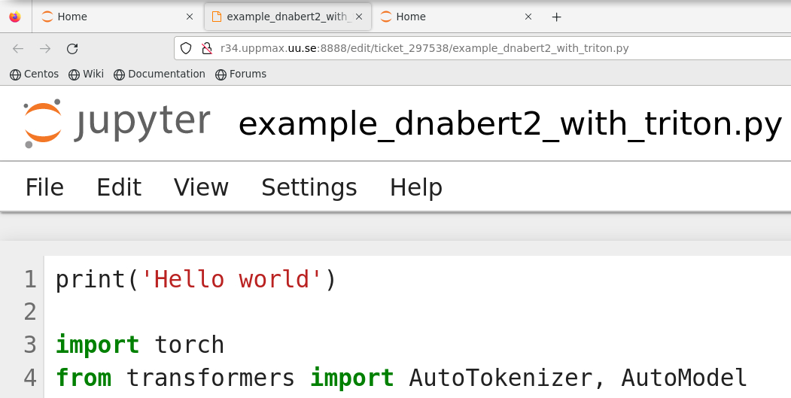

---
tags:
  - Jupyter
  - Python
  - IDE
---

# Jupyter



There are multiple [IDEs](../software/ides.md) on the UPPMAX clusters,
among other [Jupyter](../software/jupyter.md).
Here we describe how to run [Jupyter](../software/jupyter.md).

Jupyter is an [IDE](../software/ides.md) specialized for [the Python programming language](../software/python.md).

!!! info

    - You can run Python in a **Jupyter-notebook**,
      i.e. in a web interface with possibility of inline figures and debugging.
    - **Jupyter-lab** is installed in the **python>=3.10.8 module**

!!! warning

    Always start Jupyter in a **ThinLinc** session
    and preferably in an **interactive** session.

## Introduction

Jupyter is web application that allows literature programming for Python. That is, Jupyter allows to create documents where Python code is shown and run and its results shown, surrounded by written text (e.g. English).

Additionally, Jupyter allows to share files and hence includes a file manager.

Jupyter is:

- started and running on a server, for example, an interactive node
- displayed in a **web browser**, such as ``firefox``.

Jupyter can be slow when using remote desktop webpage
(e.g. ``https://rackham-gui.uppmax.uu.se``).

- For UPPMAX, one can use a locally installed ThinLinc client to speed up Jupyter. See `the UPPMAX documentation on ThinLinc <https://www.uppmax.uu.se/support/user-guides/thinlinc-graphical-connection-guide>`_ on how to install the ThinLinc client locally.

- It is also possible to run Jupyter with a local browser to speed up the graphics but still use the benefits of many CPU:s and much RAM.
    - [Run Jupyter in your local browser](jupyter_local.md)

## How to start Jupyter

- [Run Jupyter on Bianca](jupyter_on_rackham.md)
- [Run Jupyter on Rackham](jupyter_on_rackham.md)
- [Run Jupyter in the UPPMAX lab](https://lab.uppmax.uu.se)
- [Run Jupyter in your local browser](jupyter_local.md)
- Run Jupyter in a virtual environment (see below)

## Run Jupyter in a virtual environment (venv)

You could also use jupyter- (lab or notebook) in a [`venv` virtual environment](python_venv.md).

If you decide to use the ``--system-site-packages`` configuration you will get ``jupyter`` from the python modules you created you virtual environment with.
However, you won't find your locally installed packages from that jupyter session. To solve this, reinstall jupyter within the virtual environment by force (option ``-I``):

```bash
pip install -I jupyter
```

and run it as above.

Be sure to start the kernel with the virtual environment name, like "project A", and not "Python 3 (ipykernel)".

## Links

- [The Jupyter project](https://jupyter.org/) contains a lot of information and inspiration
- [The Jupyter Notebook documentation](https://jupyter-notebook.readthedocs.io/en/stable/)  
