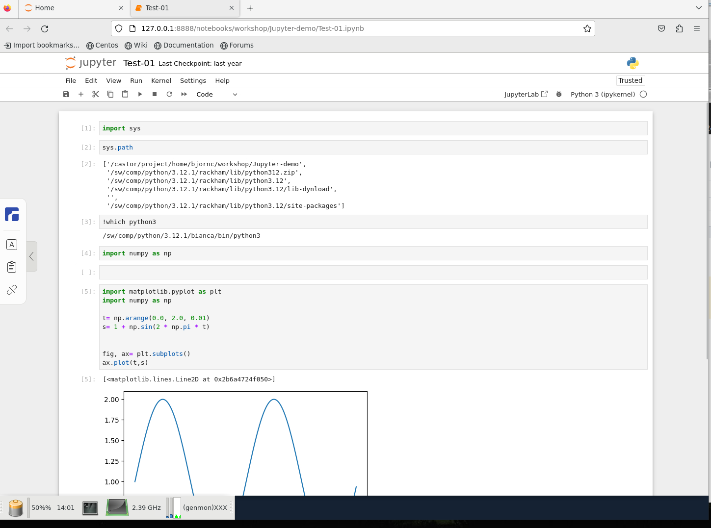

---
tags:
  - Jupyter
  - Bianca
---

# Jupyter on Bianca



There are multiple [IDEs](../software/ides.md) on the UPPMAX clusters,
among other [Jupyter](../software/jupyter.md).
Here we describe how to run [Jupyter](../software/jupyter.md)
on Bianca.

Jupyter is an [IDE](../software/ides.md) specialized for
[the Python programming language](../software/python.md).

## Procedure

??? question "Prefer a video?"

    See the YouTube video [Jupyter on Bianca](https://youtu.be/72rYjwGvWEc)

### 1. Get within SUNET

???- question "Forgot how to get within SUNET?"

    See the 'get inside the university networks' page [here](../getting_started/get_inside_sunet.md)

### 2. Start the Bianca remote desktop environment

???- tip "Forgot how to start Bianca's remote desktop environment?"

    See [the 'Logging in to Bianca' page](../getting_started/login_bianca.md).

### 3. Start an interactive session

Within the Bianca remote desktop environment, start a [terminal](../software/terminal.md).
Within that terminal,
[start an interactive node](../cluster_guides/start_interactive_node_on_bianca.md):


```bash
interactive -A [project_number] -t 8:00:00
```

Where `[project_number]` is your
[UPPMAX project](../getting_started/project.md), for example:

```bash
interactive -A sens2016001 -t 8:00:00
```

???- question "What is my UPPMAX project number?"

    Easy answers that is probably true:

    The one you used to login, which is part of your prompt.
    For example, in the prompt below, the project is `sens2016001`.

    ```bash
    [sven@sens2016001-bianca sven]$
    ```

### 4. Load a Python module

Within the terminal of the interactive session,
load a Python module

```bash
module load python/3.11.4
```

???- question "Forgot what the module system is?"

    See the UPPMAX pages on the module system [here](../cluster_guides/modules.md).

???- question "Can I use other Python modules?"

    Yes, you can use any module later than (and including) the `python/3.10.8`
    module.

### 5. Start the Jupyter notebook

Still within the terminal of the interactive session,
start a notebook like this:

```bash
jupyter-notebook --ip 0.0.0.0 --no-browser
```

or jupyter lab:

``` bash
jupyter-lab --ip 0.0.0.0 --no-browser
```

Jupyter will show some IP address in the terminal,
which you will need in the next step.

### 6. Browser to the Jupyter notebook

In the remote desktop environment on Bianca, start Firefox.
Set Firefox to the URL addresses from the Jupyter output.

???- question "Can I start Firefox from the terminal too?"

    Yes, in another terminal, one can use:

    ```bash
    firefox [URL]
    ```

    where `[URL]` is a URL produced by Jupyter, for example:

    ```bash
    firefox http://127.0.0.1:8889/tree?token=7c305e62f7dacf65d74a4b966e2851987479ad0a258de34f
    ```
