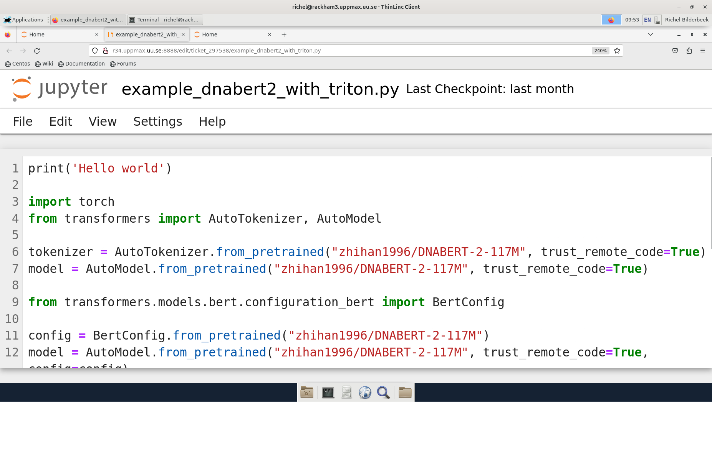

---
tags:
  - Jupyter
  - Rackham
---

# Jupyter on Rackham



There are multiple [IDEs](../software/ides.md) on the UPPMAX clusters,
among other [Jupyter](../software/jupyter.md).
Here we describe how to run [Jupyter](../software/jupyter.md)
on Rackham.

Jupyter is an [IDE](../software/ides.md) specialized for
[the Python programming language](../software/python.md).

## Procedure

??? question "Prefer a video?"

    This procedure is also demonstrated in [this YouTube video](https://youtu.be/72rYjwGvWEc?si=Rn2F2ieO-kPufO9f)

### 1. Start a Rackham remote desktop environment

This can be either:

- [Login to the Rackham remote desktop environment using the website](../getting_started/login_rackham_remote_desktop_website.md)
- [Login to the Rackham remote desktop environment using a local ThinLinc client](../getting_started/login_rackham_remote_desktop_local_thinlinc_client.md)

### 2. Start an interactive session

Within the Rackham remote desktop environment, start a [terminal](../software/terminal.md).
Within that terminal,
[start an interactive node](../cluster_guides/start_interactive_node_on_rackham.md):

```bash
interactive -A [project_number] -t 8:00:00
```

Where `[project_number]` is your
[UPPMAX project](../getting_started/project.md), for example:

```bash
interactive -A sens2016001 -t 8:00:00
```

???- question "What is my UPPMAX project number?"

    See [the UPPMAX documentation on how to see your UPPMAX projects](../getting_started/project.md)

### 3. Load a Python module

Within the terminal of the interactive session,
load a Python module

```bash
module load python/3.11.4
```

???- question "Forgot what the module system is?"

    See the UPPMAX pages on the module system [here](../cluster_guides/modules.md).

???- question "Can I use other Python modules?"

    Yes, you can use any module later than (and including) the `python/3.10.8`
    module.

### 4. Start the Jupyter notebook

Still within the terminal of the interactive session,
start a notebook like this:

```bash
jupyter-notebook --ip 0.0.0.0 --no-browser
```

or jupyter lab:

``` bash
jupyter-lab --ip 0.0.0.0 --no-browser
```

Jupyter will show some IP address in the terminal,
which you will need in the next step.

### 5. Browser to the Jupyter notebook

In the remote desktop environment on Rackham, start Firefox.
Set Firefox to the URL addresses from the Jupyter output.

???- question "Can I start Firefox from the terminal too?"

    Yes, in another terminal, one can use:

    ```bash
    firefox [URL]
    ```

    where `[URL]` is a URL produced by Jupyter, for example:

    ```bash
    firefox http://127.0.0.1:8889/tree?token=7c305e62f7dacf65d74a4b966e2851987479ad0a258de34f
    ```
