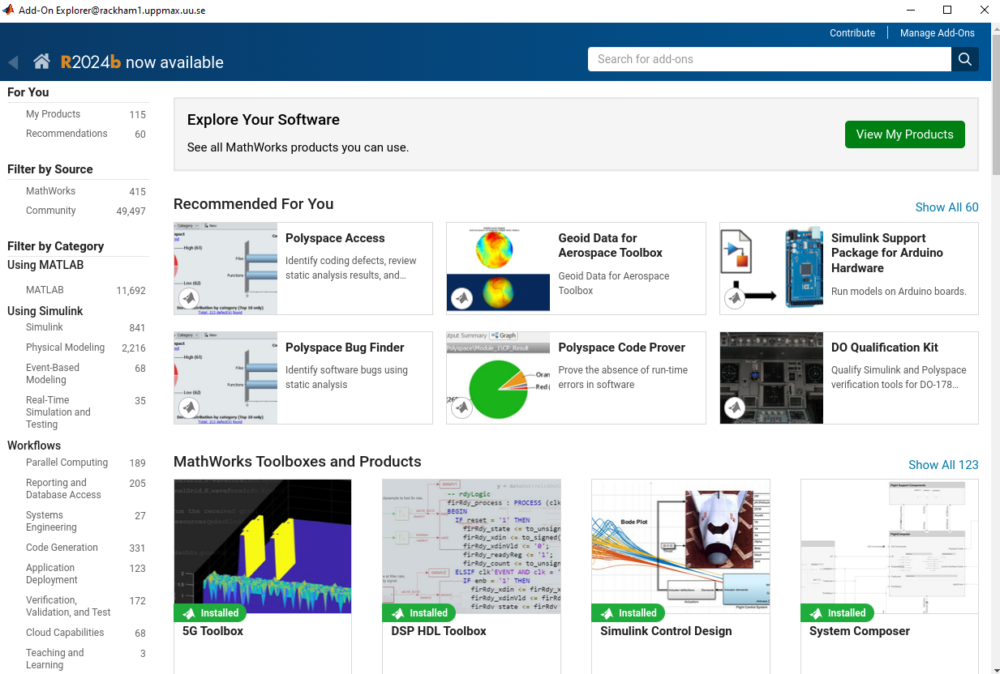
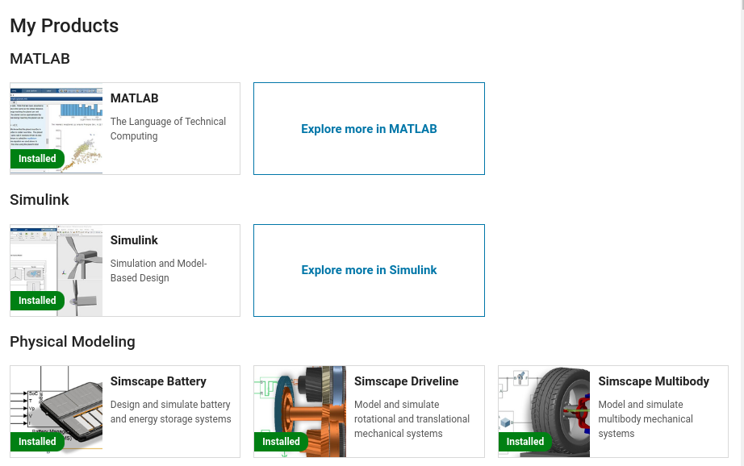

# Matlab Add-Ons

!!! admonition "MATLAB Add-Ons"

    - Add-ons extend the capabilities of MATLAB® by providing additional functionality for specific tasks and applications, such as:
        - connecting to hardware devices
        - additional algorithms
        - interactive apps
    - Available from:
        - MathWorks®
        - the global MATLAB user community
    - Encompass a wide variety of resources
        - products
        - apps
        - toolboxes
        - support packages
    - [More information from Mathworks](https://se.mathworks.com/help/matlab/add-ons.html?s_tid=CRUX_lftnavZ)


!!! admonition "Learners should be able to"

    - navigate to toolboxes and Add-Ons
    - view Add-Ons and toolboxes
    - install and use Add-Ons

- Before going into installing Add-Ons let's have a background to the MATLAB environments and ecosystem!

## MATLAB Add-Ons manager


- In the GUI, the Add-Ons manager can be selected from the menu at the top. The drop-down menu options allow users to:

   - **Browse a library of Add-Ons to download.** Note that some Add-Ons require a separate license.

   

   - **Manage Add-Ons already downloaded.**

   

   - Package user-generated code as a Toolbox or App

   - Get hardware-related support packages

- Here we will only focus on the first two options.

!!! note

    Note that very many packages are already included in the  Academic installation and license



!!! admonition "Some toolboxes"

    - Matlab products
        - Parallel Computing Toolbox
        - MATLAB Parallel Server
        - Deep Learning Toolbox
        - Statistics and Machine Learning Toolbox
    - Simulink
        - Stateflow
        - SimEvents
        - Simscape

!!! admonition "Some toolboxes provides GUI for their tools Apps"

    - Matlab products
        - Deep Network Designer - Design and visualize deep learning networks Deep Network Designer
        - Curve Fitter - Fit curves and surfaces to data
        - Deep Learning Toolbox
        - Statistics and Machine Learning Toolbox
    - Simulink
        - Stateflow
        - SimEvents
        - Simscape

    

    - We won't cover the usage of the toolboxes here!

### Install Add-Ons

- Search in add-ons explorer and install.


- Ends up in local folder and is in the part so it should be reached wherever you are in the file tree.

- ``~/MATLAB Add-Ons``

- It's in the path so it should be possible to run directly if you don't need to run a installation file.

- For more information about a specific support package install location, see the documentation for the package.

!!! warning

    To be able to install you need to use the email for a **personal mathworks account**.

!!! seealso

    You can install some Add-Ons manually using an installation file. This is useful in several situations:

    - The add-on is not available for installation through the Add-On Explorer, for example, if you create a custom add-on yourself or receive one from someone else.
    - You downloaded the add-on from the Add-On Explorer without installing it.
    - You downloaded the add-on from the File Exchange at MATLAB Central™.
    - [MathWorkds page on getting Add-Ons](https://se.mathworks.com/help/matlab/matlab_env/get-add-ons.html)

!!! admonition "Demo"

    - Search for ``kalmanf``
    - Click "Learning the Kalman Filter"
    - Look at the documentation
    - Test if the command works today:

    ```matlab

      >> kalmanf
      Unrecognized function or variable 'kalmanf'.
    ```  

    - OK, it is not there
    - Click "Add", and "Download and Add to path"
    - Type email address connected to your MathWorks account
    - Installation starts
    - It will end up in:

    ```console

      $ tree MATLAB\ Add-Ons/
      MATLAB\ Add-Ons/
      └── Collections
      |   └── Efficient\ GRIB1\ data\ reader
      |       ├── core.28328
      |       ├── license.txt
      |       ├── readGRIB1.c
      |       ├── readGRIB1.mexa64
      |       └── resources
      |           ├── addons_core.xml
      |           ├── matlab_path_entries.xml
      |           ├── metadata.xml
      |           ├── previewImage.png
      |           ├── readGRIB1.zip
      |           └── screenshot.png
      └── Functions
          └── Learning\ the\ Kalman\ Filter
              ├── kalmanf.m
              └── resources
                  ├── addons_core.xml
                  ├── kalmanf.zip
                  ├── matlab_path_entries.xml
                  ├── metadata.xml
                  ├── previewImage.png
                  └── screenshot.png
    ```

    - Evidently it is a ``function``. Note that I already have something classified as ``collections``
    - Now test:

    ```matlab

      >> kalmanf()
      'kalmanf' requires Learning the Kalman Filter version 1.0.0.0 to be enabled.
    ```

    - OK. It is installed but may need some other things. Just an example!!

!!! note "Keypoints"

    - Many Add-Ons, like toolboxes and packages are available at the Clusters
    - You can view Add-Ons and toolboxes

       - It is all more or less graphical

    - To install Add-Ons

        - Search in Add-Ons explorer and install.
        - Ends up in local folder and is in the path so it should be reached wherever you are in the file tree.
