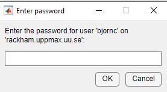

# MATLAB client on the desktop

!!! info "Use own computer's matlab"

    - Would you like to try run batch jobs on the Rackham or Snowy cluster but use the faster graphics that you can achieve on your own computer?
    - Do you have all your work locally but sometimes need the cluster to do parallel runs?
    - UPPMAX offers this now.

!!! warning

    - This solution is possible only if:
    
        - you have an UPPMAX compute project
        - a working matlab on your computer with one of the version available on the cluster:

        - check with ``module avail matlab``
        - Examples of the newest ones:

            - R2020b
            - R2022a
            - R2022b
            - R2023a
            - R2023b

## Let's get started

The Rackham MATLAB support package can be found at [uppsala.Desktop.zip](https://github.com/UPPMAX/UPPMAX-documentation/raw/main/docs/software/files/matlab/uppsala.Desktop.zip).

- Download the ZIP file and start MATLAB locally.
- The ZIP file should be unzipped in the location returned by calling.

```matlab

>> userpath
```

- You can unzip from MATLAB's Command window.
- Configure MATLAB to run parallel jobs on the cluster by calling ``configCluster``. ``configCluster`` only needs to be called once per version of MATLAB.

```matlab

>> configCluster
Username on RACKHAM (e.g. jdoe):
```

- Type your rackham user name.
- As a result:

```matlab
   
Complete.  Default cluster profile set to "Rackham R2022b".
```

!!! note

    - To submit jobs to the local machine instead of the cluster, run the following:

    ```matlab
    >> % Get a handle to the local resources
    >> c = parcluster('local');
    ```

## Configuring Slurm details

Prior to submitting the job, various parameters can be assigned, such as queue, e-mail, walltime, etc.  The following is a partial list of parameters.  See AdditionalProperties for the complete list.  Only AccountName, Partition, MemUsage and WallTime.

```matlab

>> % Get a handle to the cluster
>> c = parcluster;

c = 

  Generic Cluster

    Properties: 

                      Profile: Rackham R2022b
                     Modified: false
                         Host: UUC-4GM8L33.user.uu.se
                   NumWorkers: 100000
                   NumThreads: 1

        JobStorageLocation: <path to job outputs locally>
         ClusterMatlabRoot: /sw/apps/matlab/x86_64/R2022b
           OperatingSystem: unix
```

- Set some additional parameters related to Slurm on Rackham

```matlab

>> % Specify the account
>> c.AdditionalProperties.AccountName = 'naiss2024-22-1202';

>> % Specify the wall time (e.g., 1 day, 5 hours, 30 minutes
>> c.AdditionalProperties.WallTime = '00:30:00';

>> % Specify cores per node
>> c.AdditionalProperties.ProcsPerNode = 20;

[OPTIONAL]

>> % Specify the partition
>> c.AdditionalProperties.Partition = 'devcore';

>> % Specify another cluster: 'snowy'
>> c.AdditionalProperties.ClusterName='snowy'
>> c.AdditionalProperties.ProcsPerNode = 16;

>> % Specify number of GPUs
>> c.AdditionalProperties.GPUsPerNode = 1;
>> c.AdditionalProperties.GPUCard = 'gpu-card';
```

- Save the profile

```matlab
>> c.saveProfile
```

To see the values of the current configuration options, display AdditionalProperties.

```matlab
>> % To view current properties
>> c.AdditionalProperties
```

Unset a value when no longer needed.

```matlab
>> % Example Turn off email notifications
>> c.AdditionalProperties.EmailAddress = '';
>> c.saveProfile
```

## Start job

- Copy this script and paste in a new file ``parallel_example_local.m`` that you save in the working directory where you are (check with ``pwd`` in the Matlab Command Window).

    - The script is supposed to loop over ``sleepTime`` seconds of work ``nLoopIters`` times.
    - We will define the number of processes in the batch submit line.

```matlab
   function t = parallel_example_local(nLoopIters, sleepTime)
   t0 = tic;
   parfor idx = 1:nLoopIters
      A(idx) = idx;
      pause(sleepTime);
   end
   t = toc(t0);
```

```matlab

>> job = c.batch(@parallel_example_local, 1, {16,1}, 'Pool',8,'CurrentFolder','.');

- Submission to the cluster requires SSH credentials. 
- You will be prompted for username and password or identity file (private key). 
    - It will not ask again until you define a new cluster handle ``c`` or in next session.
```




- Jobs will now default to the cluster rather than submit to the local machine.

```matlab
>> job.State

ans =

    'running'
```

- You can run this several times until it gives:

```matlab
>> job.State

ans =

    'finished'
```

- You can also watch queue


- Or on Rackham (it really runs there!):

```console
[bjornc2@rackham2 ~]$ squeue -u bjornc2
        JOBID PARTITION     NAME     USER ST       TIME  NODES NODELIST(REASON)
        50827312   devcore MATLAB_R  bjornc2  R       2:20      1 r483
```

```matlab
>> job.fetchOutputs{:}

ans =

    2.4853
```

- The script looped over 1 s work 16 times, but with 8 processes.
- In an ideal world it would have taken ``16 / 8 = 2 s``. Now it took 2.5 s with some "overhead"

!!! admonition "Run on Snowy"

    ```matlab
    >> c.AdditionalProperties.ClusterName='snowy'
    >> c.AdditionalProperties.ProcsPerNode = 16;
    ```
    
!!! admonition "Keypoints"

    - Steps to configure
        - First time download and decompress UPPMAX configure file.
        - run configCluster on local MATLAB and set user name
    - Steps to run
        - set ``parcluster`` settings, like you do otherwise.
    - Note: only ``parcluster`` will work, not ``parpool``.
