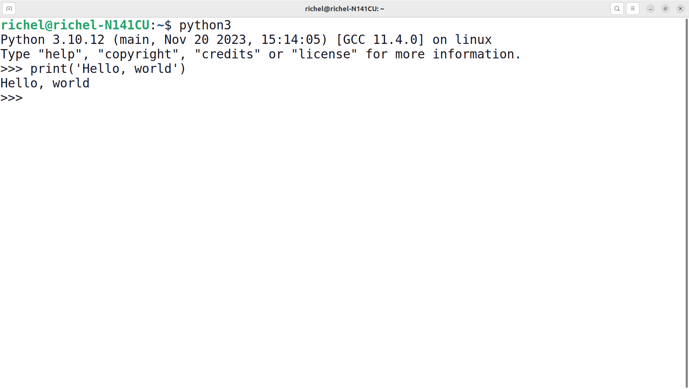
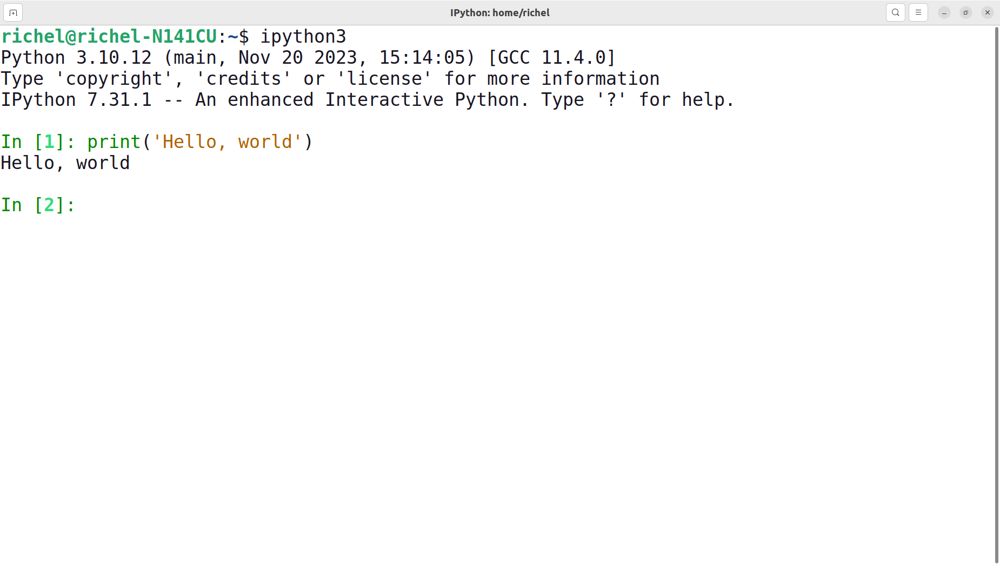

# Python programming

This page describes how to program in [Python](python.md)
on the [UPPMAX clusters](../cluster_guides/uppmax_cluster.md).

There are multiple ways to program in Python:

Description               |Features
--------------------------|------------------------------------------
Use a text editor         |Non-interactive, no help
Use the Python interpreter|Interactive, terminal-based, some help
Use IPython               |Interactive, terminal-based, more help and features
Use Jupyter               |Interactive, web-based
Use Visual Studio Code    |Interactive, install on local computer, use locally installed Python and Python packages

???- question "How does a text editor look like?"

    

    > A text editor, in this case, GNU nano

???- question "How does a Python interpreter look like?"

    

    > A Python interpreter

???- question "How does IPython look like?"

    

    > IPython

## Use a text editor

Using a text editor to program in Python 
is a simple way to write code: 
it is the same as writing any text file. 

Here we use the text editor GNU nano to write a Python script:

```
nano example_script.py
```

Within nano, write:

```
print('Hello, world!')
```

- To save, press `CTRL + O` (i.e. the letter), then enter to keep the same filename
- To quite, press `CTRL + Q`

You can run this Python script in the shell by:

```console
python example_script.py 
```

or, if you want to be explicitly use Python 3:

```console
python3 example_script.py 
```

Some features of this approach are:
- this is a simple way to write code: it is the same as writing any text file. 
- you get no help while writing code
- you can only run the script from start to finish, i.e. you cannot
  partially run the script

???- question "How to run a Python script line-by-line?"

    You can run a Python script line-by-line using a Python debugger, 
    such as `pdb`.

    On the terminal, for `python`, do:

    ```
    pdb example_script.py 
    ```

    or for `python3`:

    ```
    pdb3 example_script.py 
    ```

    See the official Python documentation of `pdb` [here](https://docs.python.org/3/library/pdb.html).

### Use the Python interpreter

After loading a Python module, you have the Python interpreter available.

???- question "Forgot how to load a Python module?"

    See the UPPMAX page about Python [here](python.md).

???- question "What is a Python interpreter?"

    In computing, an interpreter is a program that reads text 
    and runs it directly, without any additional steps.

    The Python interpreter runs the Python commands you type directly,
    without any additional steps.

Start the Python interpreter by typing:

```console
python
```

or (for explicit Python 3):

```console
python3
```

The Python prompt looks like this:

```python
>>>
```

Type, for example:

```
print('Hello, world!')
```

and the interpreter will run the statement.

Exit the Python interpreter with `<Ctrl-D>`, `quit()` or `exit()`.

The Python interpreter gives limited auto-complete while writing code

???- question "How do I get auto-complete?"

    As an example, writing this line of code in the Python interpreter ...

    ```
    s = 'Hello, world!'
    ```

    ... and press enter. Now a variable called `s` will hold some text.

    Now type ...

    ```
    s.
    ```

    and press Tab twice. You will see a list of things you can do with that string.

The Python interpreter can show graphics.

???- question "How do I get the Python interpreter to show graphics?"

    In the Python interpreter, run this code line-by-line:

    ```python
    import matplotlib.pyplot as plt
    plt.plot([1, 4, 9, 16])
    plt.show()
    ```
   
    (or as a one-liner: `import matplotlib.pyplot as plt; plt.plot([1, 4, 9, 16]); plt.show()`)

    You will see a window appear:

    

    You will only see a window appear, if you've logged in to Rackham with 
    X-forwarding enabled. See [](../getting_started/login_rackham.md)
    how to login to Rackham with X-forwarding enabled.

    Spoiler: `ssh -X sven@rackham.uppmax.uu.se`.
    
The Python interpreter cannot directly run scripts.

## Use IPython

IPython is a console program that extends the regular Python interpreter:
among others, one can directly run scripts and re-use output.

???- question "Want to see a video?"

    Here are some videos on IPython:

    - [YouTube video on `python` versus `IPython`](https://youtu.be/lhi7s6RoIys?si=Z72gSIb6q3piucPH)
    - [YouTube video on `IPython`](https://www.youtube.com/watch?v=S9rgGJYAQ8o)

After loading a Python module, you also have the IPython Python command shell available.

???- question "Forgot how to load a Python module?"

    See the UPPMAX page about Python [here](python.md).

???- question "What is a Python command shell?"

    In computing, a shell is a a program around something,
    for example, Bash is a shell around a UNIX-like operating system.

    In computing, a command shell means that the shell 
    is a command-line shell, i.e. text only.

    A Python command shell, hence, is a text-only program 
    around Python.

Start the IPython command shell by typing:

```console
ipython
```

or (for explicit Python 3):

```console
ipython3
```

The `ipython3` prompt looks like this:

```python
[richel@rackham1 ~]$ ipython
Python 3.11.4 (main, Aug  7 2023, 16:05:58) [GCC 12.2.0]
Type 'copyright', 'credits' or 'license' for more information
IPython 8.14.0 -- An enhanced Interactive Python. Type '?' for help.

In [1]: 
```

IPython allows one to write code interactively.

For example, in IPython, type:

```
print('Hello, world!')
```

and IPython will show the result of that line of code.

IPython can interact with your file system.

???- question "How does IPython interact with the file system?"

    For example, within IPython, running ...

    ```
    ls
    ```` 

    ... displays a list of files in your current working folder
    in the same way as Bash's `ls`. 

    The Python interpreter will give an error if you do the same.

IPython has an auto-complete triggered by Tab.

???- question "How do I get auto-complete?"

    As an example, writing this line of code in IPython ...

    ```
    s = 'Hello, world!'
    ```

    ... and press enter. Now a variable called `s` will hold some text.

    Now type ...

    ```
    s.
    ```

    and press Tab. You will see a menu of things you can do with that string.
    Hold tab to scroll through the many options.

IPython can show graphics.

???- question "How do I get IPython to show graphics?"

    In IPython, run this code line-by-line:

    ```python
    import matplotlib.pyplot as plt
    plt.plot([1, 2, 3, 4])
    plt.show()
    ```
   
    (or as a one-liner: `import matplotlib.pyplot as plt; plt.plot([1, 2, 3, 4]); plt.show()`)

    You will see a window appear:

    

    You will only see a window appear, if you've logged in to Rackham with 
    X-forwarding enabled. See [](../getting_started/login_rackham.md)
    how to login to Rackham with X-forwarding enabled.

    Spoiler: `ssh -X sven@rackham.uppmax.uu.se`.

IPython can directly run scripts.

???- question "How do I get IPython to directly run scripts?"

    In IPython, run:

    ```
    run [filename]
    ```

    where `[filename]` is the name of a file, for example:

    ```
    run my_script.py
    ```

    IPython will run the script and remember variables, functions and classes
    created in that script.

## Use Jupyter               

Some features are:

- interactive
- web-based

## Use Visual Studio Code    

Some features are:

- interactive
- install on local computer
- use locally installed Python and Python packages

## Links

* [Official Python documentation](https://docs.python.org/3/)
* [Python forum](https://www.python.org/community/forums/)
* [Free online book: 'How to Think Like a Computer Scientist'](https://openbookproject.net/thinkcs/python/english3e/index.html)
* [UPPMAX TensorFlow guide](https://www.uppmax.uu.se/support/user-guides/tensorflow-user-guide/)
* [UPPMAX PyTorch guide](https://www.uppmax.uu.se/support/user-guides/nvidia-deep-learning-frameworks/)


