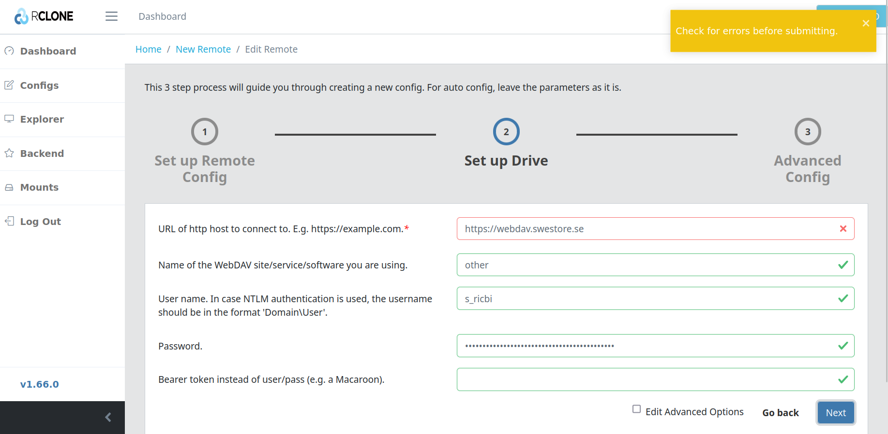
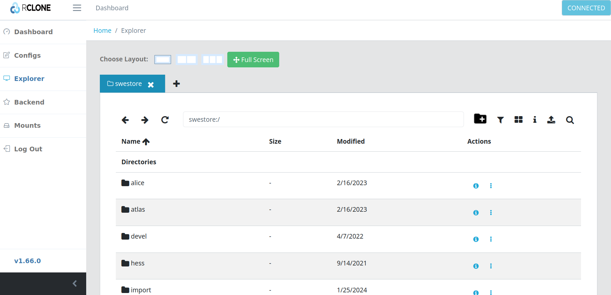

# Rclone

Rclone is a command-line program to manage files on cloud storage.

There is an Rclone module called `rclone`.

## Finding an Rclone version

```bash
module spider rclone
```

???- question "What is the output?"

    Here is some example output:

    ```console
    ---------------------------------------------------------------------------------------
      rclone: rclone/1.56.2
    ---------------------------------------------------------------------------------------

        This module can be loaded directly: module load rclone/1.56.2

        Help:
          rclone - use rclone

          Description

          a command line program to manage files on cloud storage, supporting over 40 cloud sto
    rage products

          Version 1.56.2

          https://rclone.org

          Run 'rclone config' to set up rclone for your own use.
    ```

## Loading an Rclone module

Here the Rclone module for version 1.56.2 is loaded:

```bash
module load rclone/1.56.2
```

???- question "What is the output?"

    Here is some example output:

    ```console
    rclone/1.56.2 : run 'rclone config' to set up rclone for your own use.  'man rclone' is available for further documentation, and see https://rclone.org/ for more
    ```

## Finding the Rclone config file

After having loaded an Rclone mode,
one can find the path to the Rclone config file by:

```bash
rclone config file
```

???- question "What is the output?"

    Here is some example output:

    ```console
    Configuration file doesn't exist, but rclone will use this path:
    /home/sven/.config/rclone/rclone.conf
    ```

## Using the Rclone web interface

With [SSH X forwarding enabled](ssh_x_forwarding.md), one can
use `rclone` from a web interface:

```bash
rclone rcd --rc-web-gui
```

?Do not run this on the login node?

???- question "What is the output?"

    Here is some example output:

    ```console
    2024/04/02 08:31:59 ERROR : Error reading tag file at /home/sven/.cache/rclone/webgui/tag
    2024/04/02 08:31:59 NOTICE: A new release for gui (v2.0.5) is present at https://github.com/rclone/rclone-webui-react/releases/download/v2.0.5/currentbuild.zip
    2024/04/02 08:31:59 NOTICE: Downloading webgui binary. Please wait. [Size: 4763452, Path :  /home/sven/.cache/rclone/webgui/v2.0.5.zip]
    2024/04/02 08:32:00 NOTICE: Unzipping webgui binary
    2024/04/02 08:32:01 NOTICE: Serving Web GUI
    2024/04/02 08:32:01 NOTICE: Serving remote control on http://localhost:5572/
    ```

## Connect to Swestore

Rclone is one of the recommended ways to connect to Swestore.

- [The Swestore documentation on Rclone](https://docs.swestore.se/using/rclone)
- [YouTube video: Connect to Swestore using Rclone](https://youtu.be/_MB2_GjWspw)

???- question "URL invalid?"

    When setting the URL to the correct `https://webdav.swestore.se`,
    Rclone will flag this as an error:

    

    > Rclone flags an error, that may be a false error

    However, this may be a false error. To determine this:
    click on 'Explorer' and explore Swestore.

    

    > An example Swestore folder structure

    If you see the Swestore
    folder structure above, Rclone works fine.

## Links

- [The Rclone homepage](https://rclone.org/)
- [YouTube video: A Beginner's Guide To Rclone](https://youtu.be/MwxbX6PNiWA?si=RAG3jpi7uxkYeTuo)
- [YouTube video: Connect to Swestore using Rclone](https://youtu.be/_MB2_GjWspw)
