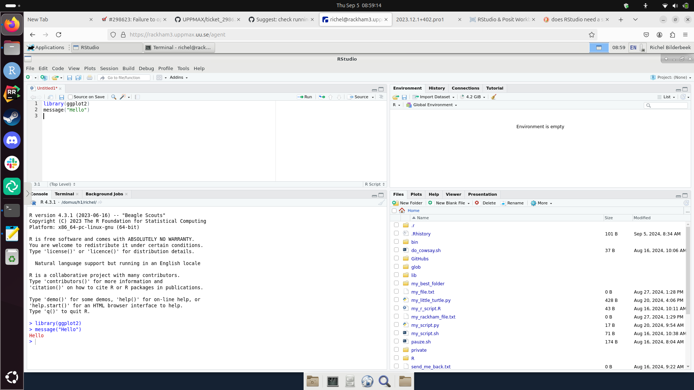
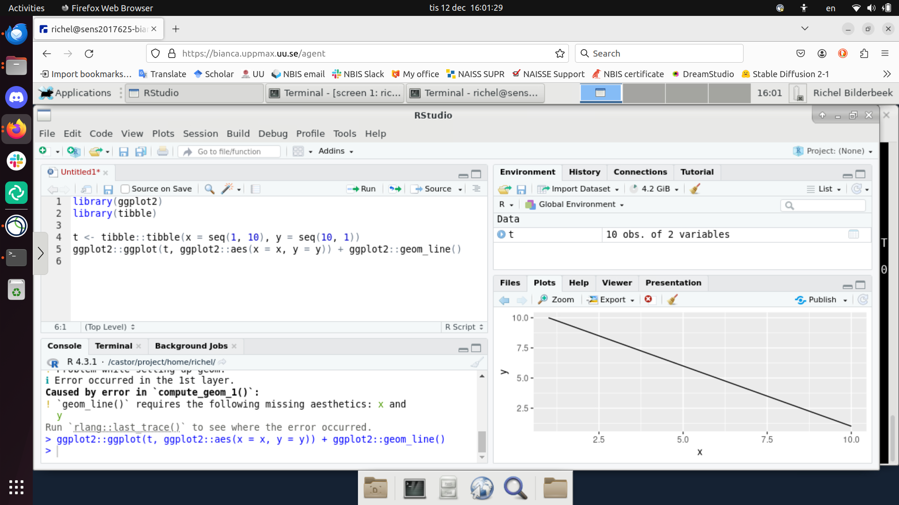

---
tags:
  - RStudio
  - Pelle
---

# RStudio on Pelle

## Introduction

[RStudio](../software/rstudio.md) is an [IDE](../software/ides.md)
specialized for the [R](../software/r.md) programming language

In this session, we show how to use RStudio on Pelle,
using Pelle's remote desktop environment.

???- tip "Forgot how to login to a remote desktop environment?"

    See [the 'Logging in to Pelle' page](../getting_started/login_pelle.md).

    Spoiler: go to [https://pelle.uppmax.uu.se/](https://pelle.uppmax.uu.se/)

As RStudio is a resource-heavy program,
it must be run on an interactive session.

???- tip "Forgot how to start an interactive session?"

    See [the 'Starting an interactive session' page](../cluster_guides/start_interactive_session_on_pelle.md).

## Procedure to start RStudio

Below is a step-by-step procedure to start RStudio on Pelle.

??? question "Prefer a video?"

    None yet :-/

## 1. Start a Pelle remote desktop environment

This can be either:

- [Login to the Pelle remote desktop environment using the website](../getting_started/login_pelle_remote_desktop_website.md)
- [Login to the Pelle remote desktop environment using a local ThinLinc client](../getting_started/login_pelle_remote_desktop_local_thinlinc_client.md)

## 2. Start an interactive session

Within the Pelle remote desktop environment, start a [terminal](../software/terminal.md).
Within that terminal, [start an interactive session](../cluster_guides/start_interactive_session_on_pelle.md)
with 2 cores:

```bash
interactive -A [naiss_project_id] -n 2 -t [duration]
```

Where:

- `[naiss_project_id]` is an [UPPMAX project code](../getting_started/project.md)
- `[duration]` is the duration of the interactive session

Resulting in, For example:

```bash
interactive -A naiss2024-22-310 -n 2 -t 8:00:00
```

!!!- info "Why two cores?"

    RStudio is a resource-heavy program.
    Due to this, we recommend using at least two cores
    for a more pleasant user experience.

???- tip "What is an interactive session?"

    See [start an interactive session](../cluster_guides/start_interactive_session_on_pelle.md)

!!!- warning "Do not start RStudio from the menus"

    You can start a version of RStudio from the menus.
    However, this will not have access to loaded modules.

    Instead, load RStudio from the module system instead.

## 3. Load the modules needed

In the terminal of the interactive session, do:

```bash
module load R/4.5.1-gfbf-2024a RStudio/2025.09.0-387
```

???- question "How does that look like?"

    Your output will be similar to:

    ```bash
    [sven@r210 sven]$ module load R/4.3.1 R_packages/4.3.1 RStudio/2023.06.2-561
    R/4.3.1: Nearly all CRAN and BioConductor packages are installed and available by loading
    the module R_packages/4.3.1
    R_packages/4.3.1: Note that loading some spatial analysis packages, especially geo-related packages, might
    R_packages/4.3.1: require you to load additional modules prior to use. monocle3 is such a package. See
    R_packages/4.3.1: 'module help R_packages/4.3.1'

    R_packages/4.3.1: The RStudio packages pane is disabled when loading this module, due to RStudio slowdowns
    R_packages/4.3.1: because there are >20000 available packages. *All packages are still available.*  For
    R_packages/4.3.1: more information and instructions to re-enable the packages pane (not recommended) see
    R_packages/4.3.1: 'module help R_packages/4.3.1'

    RStudio/2023.12.1-402: Sandboxing is not enabled for RStudio at UPPMAX. See 'module help RStudio/2023.12.1-402' for more information
    ```

???- question "What happens if I do not load `R`?"

    Then you will have the sytem-wide R version
    without any packages installed.

???- question "What does 'Sandboxing is not enabled for RStudio at UPPMAX' mean?"

    Nothing.

    Here is how it looks like:

    ```bash
    [sven@r482 sven]$ module load RStudio/2023.06.2-561
    RStudio/2023.06.2-561: Sandboxing is not enabled for RStudio at UPPMAX. See 'module help RStudio/2023.06.2-561' for more information
    [sven@r482 sven]$ module help RStudio/2023.06.2-561

    --------------------------------------------------- Module Specific Help for "RStudio/2023.06.2-561" ----------------------------------------------------
     RStudio - use RStudio 2023.06.2-561

     Version 2023.06.2-561

    With the Linux distribution used on most UPPMAX clusters (CentOS 7), RStudio/2023.06.2-561
    prefers to use a 'suid sandbox'. We do not enable this at UPPMAX. Instead, we disable sandboxing
    during startup of RStudio by defining a shell alias for the 'rstudio' command. You may notice
    additional errors in the terminal window from which you ran the 'rstudio' command. This is
    expected and does not affect RStudio operation.

    For performance reasons, UPPMAX disables checks for updates.

    UPPMAX also disables the 'Packages' pane of RStudio if an R_packages module is loaded.
    ```


## 5. Start RStudio

With the modules loaded, start RStudio from the terminal (on the
interactive session):

```bash
rstudio
```

RStudio can be slow to startup, as R has thousands (!) of packages.
Additionally, at startup and if enabled, your saved RStudio workspace
(with potentially a lot of data!) is read.

???- info "How does RStudio look on Pelle?"

    RStudio when starting up:

    

    RStudio when started up:

    

    RStudio when ready:

    

    RStudio in action:

    

    The RStudio debugger, at the error message level:

    

    The RStudio debugger, at the function-that-caused-the-error level:

    

    The RStudio debugger, at the program level:

    
