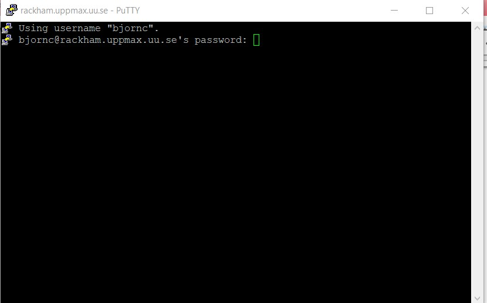
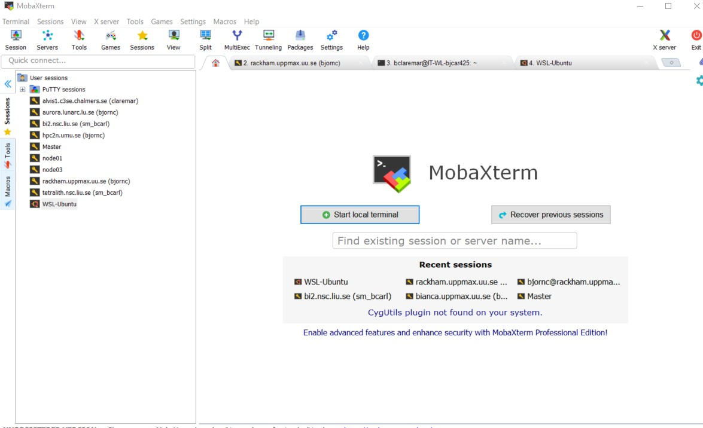
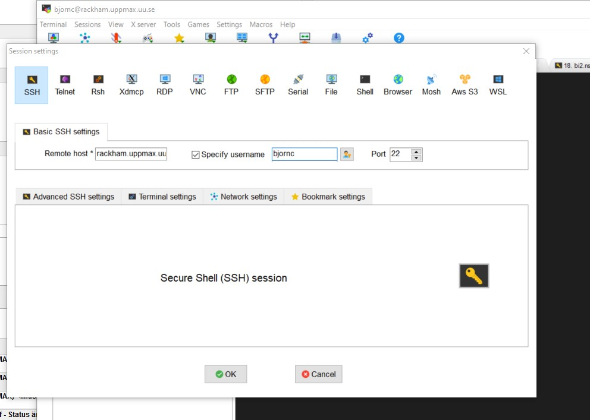

# SSH client

An SSH client is a program that allows on to use SSH.

## Overview of SSH clients

Operating system|SSH Client               |Recommended?|Allows graphics? [1]|Description
----------------|-------------------------|------------|--------------------|---------------------------------
Linux           |[`ssh`](ssh.md)          |Yes         |Yes                 |Start from a terminal
MacOS           |[`ssh`](ssh.md)          |Yes         |Yes [2]             |Start from a terminal, needs install for graphics [2]
Windows         |[MobaXterm](mobaxterm.md)|Yes         |Yes                 |Easiest for Windows users [5]
Windows         |PuTTY                    |Neutral     |Yes [3]             |Needs install for graphics [3]
Windows         |[`ssh`](ssh.md)          |Neutral     |Unknown             |Start from `CMD`, later Windows versions [4]
Windows         |[`ssh`](ssh.md)          |Neutral     |Unknown             |Start from PowerShell [4]

- [1] The technical question is 'Allows [X forwarding](ssh_x_forwarding.md)',
  as this is the way graphical displays are allowed
- [2] After installing [XQuartz](https://www.xquartz.org/)
- [3] After installing [Xming](http://www.straightrunning.com/XmingNotes/#head-13)
- [4] Untested
- [5] [MobaXterm](mobaxterm.md) has a built-in X server

## Using `ssh` with different terminals that do not allow for graphics

=== "Mac"

    - Start `terminal` (e.g. from Launchpad) or [iTerm2](https://iterm2.com/)
      to run [`ssh`](../software/ssh.md)

    ``` bash
    ssh [username]@rackham.uppmax.uu.se
    ```

    - where `[username]` is your UPPMAX username, for example `ssh sven@rackham.uppmax.uu.se`

    <!--  -->

    - iTerm2 goodies:

        - You can save hosts for later.
        - Drag and drop scp

=== "Windows"

    - Start a terminal (see below) to run [`ssh`](../software/ssh.md):

    ```bash
    $ ssh [username]@rackham.uppmax.uu.se
    ```

    - where `[username]` is your UPPMAX username, for example `ssh sven@rackham.uppmax.uu.se`

    

    - The ssh (secure shell) client [**putty**](https://www.putty.org/)

        - You can save hosts for later.
        - No graphics.

    - Windows Powershell terminal can also work

        - Cannot save hosts
        - no graphics
        - [PowerShell](https://learn.microsoft.com/en-us/powershell/)

    - Windows command prompt can also work

        - Cannot save hosts
        - no graphics
        - [Command Prompt](https://www.makeuseof.com/tag/a-beginners-guide-to-the-windows-command-line/)

    - [Git bash](https://gitforwindows.org/)

## Using `ssh` with different terminals that allow for graphics

=== "Mac"

    - Download XQuartz or other X11 server for Mac OS from [https://www.xquartz.org/](https://www.xquartz.org/)

    ???- question "How do I know XQuartz has been installed?"

        As far as we know: you cannot check this directly:
        you will have to find out by running an application of
        Rackham that uses this. See below :-)

    - Start `terminal` (e.g. from Launchpad) or [iTerm2](https://iterm2.com/)
      to run [`ssh`](../software/ssh.md):

    ``` bash
    $ ssh -X [username]@rackham.uppmax.uu.se
    ```

    where `[username]` is your UPPMAX username and `-X` enables [X forwarding](../software/ssh_x_forwarding.md).
    For example, if your UPPMAX username is `sven`, this would be
    `ssh -X sven@rackham.uppmax.uu.se`

    ???- question "How do I know XQuartz has been installed?"

        See [SSH X forwarding](../software/ssh_x_forwading.md).

        Spoiler: use [`xeyes`](../software/xeyes.md)

=== "Windows"

    - Download and install ONE of the X-servers below (to enable graphics)
        - [GWSL](https://opticos.github.io/gwsl) (recommended because of hardware integration)
        - [X-ming](https://sourceforge.net/projects/xming/)
        - [VCXSRV](https://sourceforge.net/projects/vcxsrv/)


    - or...

    - Install a ssh (secure shell) program with built-in X11 and sftp file manager
        - [**MobaXterm**](https://mobaxterm.mobatek.net/)
        - sftp frame makes it easy to move, upload and download files.
        - ... though downloading from remote host to local is usually easier.
        - tabs for several sessions

    <!--  -->

    - Start local terminal and [an SSH session](../software/ssh.md) by:

    ``` bash
    $ ssh -X [username]@rackham.uppmax.uu.se
    ```

    where `[username]` is your UPPMAX username and `-X` enables [X forwarding](../software/ssh_x_forwarding.md).
    For example, if your UPPMAX username is `sven`, this would be
    `ssh -X sven@rackham.uppmax.uu.se`

    

    - Or even better, create and save a SSH session, as shown in image below.
        - This allows you to use MobaXterm as a file manager and  to use the built-in graphical texteditor.
        - You can rename the session in the Bookmark settings tab.

    
