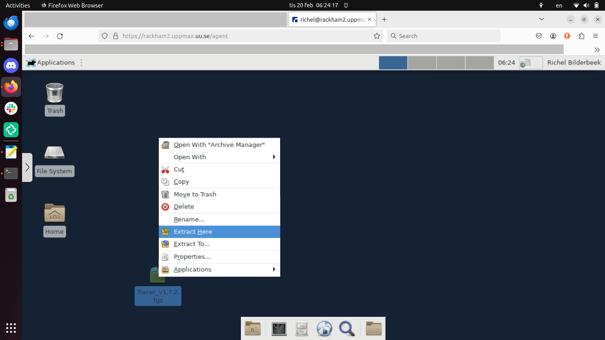

# Tracer

Tracer is a tool to analyse the results of a
[BEAST](beast.md) or [BEAST2](beast2.md) run.

Tracer is not an UPPMAX module.

Instead, it needs to be download and run:

## 1. Download

Pick [a Tracer release](https://github.com/beast-dev/tracer/releases),
such as [Tracer v1.7.2](https://github.com/beast-dev/tracer/releases/tag/v1.7.2)
and download the Linux/UNIX version.

???- question "How does that look like?"

    Here is how the release page of [Tracer v1.7.2](https://github.com/beast-dev/tracer/releases/tag/v1.7.2)
    looks like:

    

    > Tracer

    Download the file `Tracer_v1.7.2.tgz`.

???- question "How to download from the command-line?"

    Use `wget` on the URL to download from, for example:

    ```bash
    wget https://github.com/beast-dev/tracer/releases/download/v1.7.2/Tracer_v1.7.2.tgz
    ```

## 2. Extract

Extract the downloaded file.

???- question "How to do so, using the remote desktop environment?"

    Right-click the file and click 'Extract here'.

    

???- question "How to do so, using the console environment?"

    Use `tar` on the file to extract:

    ```bash
    tar zxvf  Tracer_v1.7.2.tgz
    ```

## 3. Run

Use `java` to run the Tracer `jar` file:

```bash
java -jar lib/tracer.jar
```

???- question "How does that look like?"

    Here is how Tracer looks like in a console environment:

    

    > Tracer in a console environment

    For this to work, one needs to login using
    [SSH with X forwarding](../software/ssh_x_forwarding.md) enabled.

    Spoiler: use `ssh -X`

## Links

* [Tracer GitHub repository](https://github.com/beast-dev/tracer)
